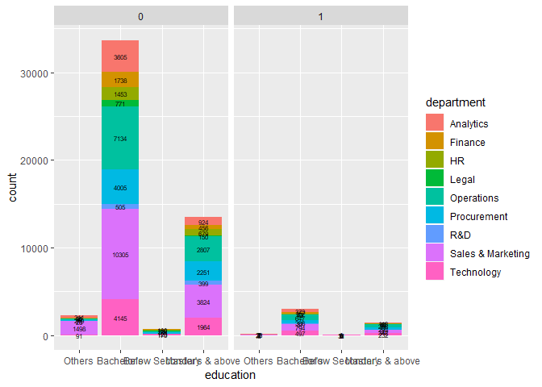
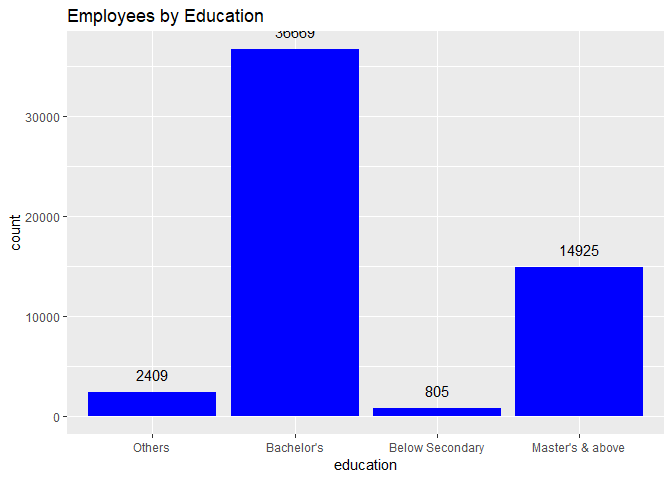
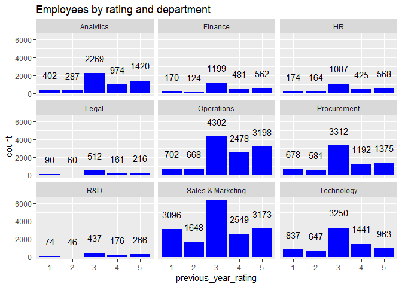

HR Analytics v2
================
Shweta Tyagi
12/04/2019

``` r
# Load the Training Data and Test Data
HRTrain <- read.csv(file.choose(), header= TRUE)

# Load Libraries
library(dplyr)
```

    ## 
    ## Attaching package: 'dplyr'

    ## The following objects are masked from 'package:stats':
    ## 
    ##     filter, lag

    ## The following objects are masked from 'package:base':
    ## 
    ##     intersect, setdiff, setequal, union

``` r
library(ggplot2)
library(caret)
```

    ## Loading required package: lattice

``` r
library(caTools)
library(gmodels)
library(randomForest)
```

    ## randomForest 4.6-14

    ## Type rfNews() to see new features/changes/bug fixes.

    ## 
    ## Attaching package: 'randomForest'

    ## The following object is masked from 'package:ggplot2':
    ## 
    ##     margin

    ## The following object is masked from 'package:dplyr':
    ## 
    ##     combine

``` r
library(rpart)
library(rpart.plot)
library(ROSE)
```

    ## Loaded ROSE 0.0-3

``` r
library(e1071)

# Exploratory Data Analysis
## There are 54,808 observations and 14 variables in the Train Data and 23,490 observations and 13 variables in the test data
str(HRTrain)
```

    ## 'data.frame':    54808 obs. of  14 variables:
    ##  $ employee_id         : int  65438 65141 7513 2542 48945 58896 20379 16290 73202 28911 ...
    ##  $ department          : Factor w/ 9 levels "Analytics","Finance",..: 8 5 8 8 9 1 5 5 1 8 ...
    ##  $ region              : Factor w/ 34 levels "region_1","region_10",..: 32 15 11 16 19 12 13 28 13 1 ...
    ##  $ education           : Factor w/ 4 levels "","Bachelor's",..: 4 2 2 2 2 2 2 4 2 4 ...
    ##  $ gender              : Factor w/ 2 levels "f","m": 1 2 2 2 2 2 1 2 2 2 ...
    ##  $ recruitment_channel : Factor w/ 3 levels "other","referred",..: 3 1 3 1 1 3 1 3 1 3 ...
    ##  $ no_of_trainings     : int  1 1 1 2 1 2 1 1 1 1 ...
    ##  $ age                 : int  35 30 34 39 45 31 31 33 28 32 ...
    ##  $ previous_year_rating: int  5 5 3 1 3 3 3 3 4 5 ...
    ##  $ length_of_service   : int  8 4 7 10 2 7 5 6 5 5 ...
    ##  $ KPIs_met..80.       : int  1 0 0 0 0 0 0 0 0 1 ...
    ##  $ awards_won.         : int  0 0 0 0 0 0 0 0 0 0 ...
    ##  $ avg_training_score  : int  49 60 50 50 73 85 59 63 83 54 ...
    ##  $ is_promoted         : int  0 0 0 0 0 0 0 0 0 0 ...

``` r
summary(HRTrain)
```

    ##   employee_id                department          region     
    ##  Min.   :    1   Sales & Marketing:16840   region_2 :12343  
    ##  1st Qu.:19670   Operations       :11348   region_22: 6428  
    ##  Median :39226   Procurement      : 7138   region_7 : 4843  
    ##  Mean   :39196   Technology       : 7138   region_15: 2808  
    ##  3rd Qu.:58731   Analytics        : 5352   region_13: 2648  
    ##  Max.   :78298   Finance          : 2536   region_26: 2260  
    ##                  (Other)          : 4456   (Other)  :23478  
    ##             education     gender    recruitment_channel no_of_trainings 
    ##                  : 2409   f:16312   other   :30446      Min.   : 1.000  
    ##  Bachelor's      :36669   m:38496   referred: 1142      1st Qu.: 1.000  
    ##  Below Secondary :  805             sourcing:23220      Median : 1.000  
    ##  Master's & above:14925                                 Mean   : 1.253  
    ##                                                         3rd Qu.: 1.000  
    ##                                                         Max.   :10.000  
    ##                                                                         
    ##       age       previous_year_rating length_of_service KPIs_met..80.  
    ##  Min.   :20.0   Min.   :1.000        Min.   : 1.000    Min.   :0.000  
    ##  1st Qu.:29.0   1st Qu.:3.000        1st Qu.: 3.000    1st Qu.:0.000  
    ##  Median :33.0   Median :3.000        Median : 5.000    Median :0.000  
    ##  Mean   :34.8   Mean   :3.329        Mean   : 5.866    Mean   :0.352  
    ##  3rd Qu.:39.0   3rd Qu.:4.000        3rd Qu.: 7.000    3rd Qu.:1.000  
    ##  Max.   :60.0   Max.   :5.000        Max.   :37.000    Max.   :1.000  
    ##                 NA's   :4124                                          
    ##   awards_won.      avg_training_score  is_promoted     
    ##  Min.   :0.00000   Min.   :39.00      Min.   :0.00000  
    ##  1st Qu.:0.00000   1st Qu.:51.00      1st Qu.:0.00000  
    ##  Median :0.00000   Median :60.00      Median :0.00000  
    ##  Mean   :0.02317   Mean   :63.39      Mean   :0.08517  
    ##  3rd Qu.:0.00000   3rd Qu.:76.00      3rd Qu.:0.00000  
    ##  Max.   :1.00000   Max.   :99.00      Max.   :1.00000  
    ## 

``` r
## Dependent Variable : is_promoted
### Only 8.51% of employees were promoted.
HRTrain$is_promoted<-as.factor(HRTrain$is_promoted)
summary(HRTrain$is_promoted)
```

    ##     0     1 
    ## 50140  4668

``` r
prop.table(table(HRTrain$is_promoted))
```

    ## 
    ##          0          1 
    ## 0.91482995 0.08517005

``` r
ggplot(data=HRTrain, aes(x=is_promoted))+geom_bar(fill="blue")+geom_text(stat="count", aes(label=..count..), vjust=-1)+labs(title="No of Promotions")
```

<!-- -->

``` r
## Independent Variable: Department 
### There are 9 departments with Sales and Marketing, Operations, Procurement and Technology being the largest ones.
unique(HRTrain$department)
```

    ## [1] Sales & Marketing Operations        Technology        Analytics        
    ## [5] R&D               Procurement       Finance           HR               
    ## [9] Legal            
    ## 9 Levels: Analytics Finance HR Legal Operations Procurement ... Technology

``` r
summary(HRTrain$department)
```

    ##         Analytics           Finance                HR             Legal 
    ##              5352              2536              2418              1039 
    ##        Operations       Procurement               R&D Sales & Marketing 
    ##             11348              7138               999             16840 
    ##        Technology 
    ##              7138

``` r
prop.table(table(HRTrain$department))
```

    ## 
    ##         Analytics           Finance                HR             Legal 
    ##        0.09764998        0.04627062        0.04411765        0.01895709 
    ##        Operations       Procurement               R&D Sales & Marketing 
    ##        0.20705007        0.13023646        0.01822727        0.30725442 
    ##        Technology 
    ##        0.13023646

``` r
### Lets look at the relationship between the dependent variable and 'Department'using a Chi Square Test. P value is less than 0. 
CrossTable(HRTrain$is_promoted, HRTrain$department, chisq = TRUE)
```

    ## 
    ##  
    ##    Cell Contents
    ## |-------------------------|
    ## |                       N |
    ## | Chi-square contribution |
    ## |           N / Row Total |
    ## |           N / Col Total |
    ## |         N / Table Total |
    ## |-------------------------|
    ## 
    ##  
    ## Total Observations in Table:  54808 
    ## 
    ##  
    ##                     | HRTrain$department 
    ## HRTrain$is_promoted |         Analytics |           Finance |                HR |             Legal |        Operations |       Procurement |               R&D | Sales & Marketing |        Technology |         Row Total | 
    ## --------------------|-------------------|-------------------|-------------------|-------------------|-------------------|-------------------|-------------------|-------------------|-------------------|-------------------|
    ##                   0 |              4840 |              2330 |              2282 |               986 |             10325 |              6450 |               930 |             15627 |              6370 |             50140 | 
    ##                     |             0.644 |             0.043 |             2.211 |             1.325 |             0.307 |             0.981 |             0.283 |             3.178 |             3.923 |                   | 
    ##                     |             0.097 |             0.046 |             0.046 |             0.020 |             0.206 |             0.129 |             0.019 |             0.312 |             0.127 |             0.915 | 
    ##                     |             0.904 |             0.919 |             0.944 |             0.949 |             0.910 |             0.904 |             0.931 |             0.928 |             0.892 |                   | 
    ##                     |             0.088 |             0.043 |             0.042 |             0.018 |             0.188 |             0.118 |             0.017 |             0.285 |             0.116 |                   | 
    ## --------------------|-------------------|-------------------|-------------------|-------------------|-------------------|-------------------|-------------------|-------------------|-------------------|-------------------|
    ##                   1 |               512 |               206 |               136 |                53 |              1023 |               688 |                69 |              1213 |               768 |              4668 | 
    ##                     |             6.922 |             0.462 |            23.753 |            14.235 |             3.302 |            10.542 |             3.041 |            34.134 |            42.139 |                   | 
    ##                     |             0.110 |             0.044 |             0.029 |             0.011 |             0.219 |             0.147 |             0.015 |             0.260 |             0.165 |             0.085 | 
    ##                     |             0.096 |             0.081 |             0.056 |             0.051 |             0.090 |             0.096 |             0.069 |             0.072 |             0.108 |                   | 
    ##                     |             0.009 |             0.004 |             0.002 |             0.001 |             0.019 |             0.013 |             0.001 |             0.022 |             0.014 |                   | 
    ## --------------------|-------------------|-------------------|-------------------|-------------------|-------------------|-------------------|-------------------|-------------------|-------------------|-------------------|
    ##        Column Total |              5352 |              2536 |              2418 |              1039 |             11348 |              7138 |               999 |             16840 |              7138 |             54808 | 
    ##                     |             0.098 |             0.046 |             0.044 |             0.019 |             0.207 |             0.130 |             0.018 |             0.307 |             0.130 |                   | 
    ## --------------------|-------------------|-------------------|-------------------|-------------------|-------------------|-------------------|-------------------|-------------------|-------------------|-------------------|
    ## 
    ##  
    ## Statistics for All Table Factors
    ## 
    ## 
    ## Pearson's Chi-squared test 
    ## ------------------------------------------------------------
    ## Chi^2 =  151.4264     d.f. =  8     p =  9.882497e-29 
    ## 
    ## 
    ## 

``` r
ggplot(data=HRTrain, aes(x=department))+geom_bar(aes(y=(..count..)/sum(..count..)), fill="blue")+facet_wrap(~is_promoted)+geom_text(aes(y=((..count..)/sum(..count..)),label=scales::percent((..count..)/sum(..count..))),stat="count",vjust=-0.25)+scale_y_continuous(labels=scales::percent)+ylab("Proportion of employees in each department")
```

<!-- -->

``` r
ggplot(data=HRTrain, aes(x=department))+geom_bar(fill="blue")+geom_text(stat="count", aes(label=..count..), vjust=-1)+labs(title="Number of Employees in each Department")
```

<!-- -->

``` r
ggplot(data=HRTrain, aes(x=is_promoted))+geom_bar(fill="blue")+facet_wrap(~department)+geom_text(aes(label=..count..), stat="count", vjust=-1)
```

<!-- -->

``` r
ggplot(data=HRTrain, aes(x=department))+geom_bar(fill="blue")+facet_wrap(~is_promoted)+geom_text(aes(label=..count..), stat="count", vjust=-1)
```

<!-- -->

``` r
## Independent Variable : Region. There are 34 levels for the variable 'region'. 
str(HRTrain$region)
```

    ##  Factor w/ 34 levels "region_1","region_10",..: 32 15 11 16 19 12 13 28 13 1 ...

``` r
prop.table(table(HRTrain$region))
```

    ## 
    ##     region_1    region_10    region_11    region_12    region_13 
    ## 0.0111297621 0.0118230915 0.0239928478 0.0091227558 0.0483141147 
    ##    region_14    region_15    region_16    region_17    region_18 
    ## 0.0150890381 0.0512333966 0.0267296745 0.0145234272 0.0005656109 
    ##    region_19     region_2    region_20    region_21    region_22 
    ## 0.0159465771 0.2252043497 0.0155086849 0.0074989053 0.1172821486 
    ##    region_23    region_24    region_25    region_26    region_27 
    ## 0.0214384761 0.0092687199 0.0149430740 0.0412348562 0.0302693038 
    ##    region_28    region_29     region_3    region_30    region_31 
    ## 0.0240475843 0.0181360385 0.0063129470 0.0119873011 0.0353050650 
    ##    region_32    region_33    region_34     region_4     region_5 
    ## 0.0172420085 0.0049080426 0.0053276894 0.0310721063 0.0139760619 
    ##     region_6     region_7     region_8     region_9 
    ## 0.0125894030 0.0883630127 0.0119508101 0.0076631149

``` r
### Lets look at the relationship between the dependent variable and 'Region'using a Chi Square Test. P value is less than 0. 
CrossTable(HRTrain$is_promoted, HRTrain$region, chisq = TRUE)
```

    ## Warning in chisq.test(t, correct = FALSE, ...): Chi-squared approximation
    ## may be incorrect

    ## 
    ##  
    ##    Cell Contents
    ## |-------------------------|
    ## |                       N |
    ## | Chi-square contribution |
    ## |           N / Row Total |
    ## |           N / Col Total |
    ## |         N / Table Total |
    ## |-------------------------|
    ## 
    ##  
    ## Total Observations in Table:  54808 
    ## 
    ##  
    ##                     | HRTrain$region 
    ## HRTrain$is_promoted |  region_1 | region_10 | region_11 | region_12 | region_13 | region_14 | region_15 | region_16 | region_17 | region_18 | region_19 |  region_2 | region_20 | region_21 | region_22 | region_23 | region_24 | region_25 | region_26 | region_27 | region_28 | region_29 |  region_3 | region_30 | region_31 | region_32 | region_33 | region_34 |  region_4 |  region_5 |  region_6 |  region_7 |  region_8 |  region_9 | Row Total | 
    ## --------------------|-----------|-----------|-----------|-----------|-----------|-----------|-----------|-----------|-----------|-----------|-----------|-----------|-----------|-----------|-----------|-----------|-----------|-----------|-----------|-----------|-----------|-----------|-----------|-----------|-----------|-----------|-----------|-----------|-----------|-----------|-----------|-----------|-----------|-----------|-----------|
    ##                   0 |       552 |       597 |      1241 |       467 |      2418 |       765 |      2586 |      1363 |       687 |        30 |       821 |     11354 |       801 |       393 |      5694 |      1038 |       490 |       716 |      2117 |      1528 |      1164 |       951 |       309 |       598 |      1825 |       905 |       259 |       284 |      1457 |       731 |       658 |      4327 |       602 |       412 |     50140 | 
    ##                     |     0.066 |     0.030 |     1.200 |     0.201 |     0.008 |     0.094 |     0.115 |     0.387 |     2.332 |     0.095 |     0.575 |     0.343 |     0.704 |     0.769 |     5.917 |     1.268 |     1.374 |     1.475 |     1.184 |     0.070 |     1.445 |     1.908 |     0.179 |     0.015 |     1.697 |     1.896 |     0.677 |     1.065 |     6.542 |     1.305 |     1.135 |     2.419 |     0.013 |     2.007 |           | 
    ##                     |     0.011 |     0.012 |     0.025 |     0.009 |     0.048 |     0.015 |     0.052 |     0.027 |     0.014 |     0.001 |     0.016 |     0.226 |     0.016 |     0.008 |     0.114 |     0.021 |     0.010 |     0.014 |     0.042 |     0.030 |     0.023 |     0.019 |     0.006 |     0.012 |     0.036 |     0.018 |     0.005 |     0.006 |     0.029 |     0.015 |     0.013 |     0.086 |     0.012 |     0.008 |     0.915 | 
    ##                     |     0.905 |     0.921 |     0.944 |     0.934 |     0.913 |     0.925 |     0.921 |     0.930 |     0.863 |     0.968 |     0.939 |     0.920 |     0.942 |     0.956 |     0.886 |     0.883 |     0.965 |     0.874 |     0.937 |     0.921 |     0.883 |     0.957 |     0.893 |     0.910 |     0.943 |     0.958 |     0.963 |     0.973 |     0.856 |     0.954 |     0.954 |     0.893 |     0.919 |     0.981 |           | 
    ##                     |     0.010 |     0.011 |     0.023 |     0.009 |     0.044 |     0.014 |     0.047 |     0.025 |     0.013 |     0.001 |     0.015 |     0.207 |     0.015 |     0.007 |     0.104 |     0.019 |     0.009 |     0.013 |     0.039 |     0.028 |     0.021 |     0.017 |     0.006 |     0.011 |     0.033 |     0.017 |     0.005 |     0.005 |     0.027 |     0.013 |     0.012 |     0.079 |     0.011 |     0.008 |           | 
    ## --------------------|-----------|-----------|-----------|-----------|-----------|-----------|-----------|-----------|-----------|-----------|-----------|-----------|-----------|-----------|-----------|-----------|-----------|-----------|-----------|-----------|-----------|-----------|-----------|-----------|-----------|-----------|-----------|-----------|-----------|-----------|-----------|-----------|-----------|-----------|-----------|
    ##                   1 |        58 |        51 |        74 |        33 |       230 |        62 |       222 |       102 |       109 |         1 |        53 |       989 |        49 |        18 |       734 |       137 |        18 |       103 |       143 |       131 |       154 |        43 |        37 |        59 |       110 |        40 |        10 |         8 |       246 |        35 |        32 |       516 |        53 |         8 |      4668 | 
    ##                     |     0.704 |     0.318 |    12.892 |     2.157 |     0.089 |     1.010 |     1.231 |     4.157 |    25.043 |     1.019 |     6.174 |     3.687 |     7.560 |     8.261 |    63.551 |    13.625 |    14.755 |    15.845 |    12.722 |     0.750 |    15.525 |    20.500 |     1.925 |     0.166 |    18.225 |    20.365 |     7.276 |    11.443 |    70.268 |    14.017 |    12.192 |    25.981 |     0.139 |    21.561 |           | 
    ##                     |     0.012 |     0.011 |     0.016 |     0.007 |     0.049 |     0.013 |     0.048 |     0.022 |     0.023 |     0.000 |     0.011 |     0.212 |     0.010 |     0.004 |     0.157 |     0.029 |     0.004 |     0.022 |     0.031 |     0.028 |     0.033 |     0.009 |     0.008 |     0.013 |     0.024 |     0.009 |     0.002 |     0.002 |     0.053 |     0.007 |     0.007 |     0.111 |     0.011 |     0.002 |     0.085 | 
    ##                     |     0.095 |     0.079 |     0.056 |     0.066 |     0.087 |     0.075 |     0.079 |     0.070 |     0.137 |     0.032 |     0.061 |     0.080 |     0.058 |     0.044 |     0.114 |     0.117 |     0.035 |     0.126 |     0.063 |     0.079 |     0.117 |     0.043 |     0.107 |     0.090 |     0.057 |     0.042 |     0.037 |     0.027 |     0.144 |     0.046 |     0.046 |     0.107 |     0.081 |     0.019 |           | 
    ##                     |     0.001 |     0.001 |     0.001 |     0.001 |     0.004 |     0.001 |     0.004 |     0.002 |     0.002 |     0.000 |     0.001 |     0.018 |     0.001 |     0.000 |     0.013 |     0.002 |     0.000 |     0.002 |     0.003 |     0.002 |     0.003 |     0.001 |     0.001 |     0.001 |     0.002 |     0.001 |     0.000 |     0.000 |     0.004 |     0.001 |     0.001 |     0.009 |     0.001 |     0.000 |           | 
    ## --------------------|-----------|-----------|-----------|-----------|-----------|-----------|-----------|-----------|-----------|-----------|-----------|-----------|-----------|-----------|-----------|-----------|-----------|-----------|-----------|-----------|-----------|-----------|-----------|-----------|-----------|-----------|-----------|-----------|-----------|-----------|-----------|-----------|-----------|-----------|-----------|
    ##        Column Total |       610 |       648 |      1315 |       500 |      2648 |       827 |      2808 |      1465 |       796 |        31 |       874 |     12343 |       850 |       411 |      6428 |      1175 |       508 |       819 |      2260 |      1659 |      1318 |       994 |       346 |       657 |      1935 |       945 |       269 |       292 |      1703 |       766 |       690 |      4843 |       655 |       420 |     54808 | 
    ##                     |     0.011 |     0.012 |     0.024 |     0.009 |     0.048 |     0.015 |     0.051 |     0.027 |     0.015 |     0.001 |     0.016 |     0.225 |     0.016 |     0.007 |     0.117 |     0.021 |     0.009 |     0.015 |     0.041 |     0.030 |     0.024 |     0.018 |     0.006 |     0.012 |     0.035 |     0.017 |     0.005 |     0.005 |     0.031 |     0.014 |     0.013 |     0.088 |     0.012 |     0.008 |           | 
    ## --------------------|-----------|-----------|-----------|-----------|-----------|-----------|-----------|-----------|-----------|-----------|-----------|-----------|-----------|-----------|-----------|-----------|-----------|-----------|-----------|-----------|-----------|-----------|-----------|-----------|-----------|-----------|-----------|-----------|-----------|-----------|-----------|-----------|-----------|-----------|-----------|
    ## 
    ##  
    ## Statistics for All Table Factors
    ## 
    ## 
    ## Pearson's Chi-squared test 
    ## ------------------------------------------------------------
    ## Chi^2 =  475.6402     d.f. =  33     p =  7.275378e-80 
    ## 
    ## 
    ## 

``` r
### We will reduce the number of levels of Region variable from 34 to 3 : Low (< 3%), Medium(3%-8%), High(>8%)
### Low-18,33,34,3,21,9,12,24,1,30,10,8,5,6,17,25,14,20,19,32,29,23,28,11,16 -Medium 27,31,26,13,15,7,4 -High 2,22
levels(HRTrain$region)[levels(HRTrain$region)=='region_2'] <- 'High'
levels(HRTrain$region)[levels(HRTrain$region)=='region_22'] <- 'High'
levels(HRTrain$region)[levels(HRTrain$region)=='region_15' | levels(HRTrain$region)=="region_7"] <- 'Medium'
levels(HRTrain$region)[levels(HRTrain$region)=='region_27' | levels(HRTrain$region)=="region_31" | levels(HRTrain$region)=="region_4"] <- 'Medium'
levels(HRTrain$region)[levels(HRTrain$region)=='region_26' | levels(HRTrain$region)=="region_13"] <- 'Medium'
levels(HRTrain$region)[levels(HRTrain$region)=='region_23' | levels(HRTrain$region)=="region_28" | levels(HRTrain$region)=="region_11" | levels(HRTrain$region)=="region_16"] <- 'Low'
levels(HRTrain$region)[levels(HRTrain$region)=='region_1' | levels(HRTrain$region)=="region_30" | levels(HRTrain$region)=="region_10" | levels(HRTrain$region)=="region_8" | levels(HRTrain$region)=="region_5" | levels(HRTrain$region)=="region_6" |levels(HRTrain$region)=="region_17"|levels(HRTrain$region)=="region_25" ] <- 'Low'
levels(HRTrain$region)[levels(HRTrain$region)=='region_18' | levels(HRTrain$region)=="region_33" | levels(HRTrain$region)=="region_34" | levels(HRTrain$region)=="region_3" | levels(HRTrain$region)=="region_21" | levels(HRTrain$region)=="region_9" |levels(HRTrain$region)=="region_12"|levels(HRTrain$region)=="region_24" ] <- 'Low'
levels(HRTrain$region)[levels(HRTrain$region)=='region_14' | levels(HRTrain$region)=="region_20" | levels(HRTrain$region)=="region_19" | levels(HRTrain$region)=="region_29" | levels(HRTrain$region)=="region_32"] <- 'Low'
ggplot(data=HRTrain, aes(x=region))+geom_bar(fill="blue")+geom_text(stat="count",aes(label=..count..), vjust=-1)+labs(title="Employees per region")
```

<!-- -->

``` r
ggplot(data=HRTrain, aes(x=region))+geom_bar(fill="blue")+geom_text(stat="count",aes(label=..count..), vjust=-1)+facet_wrap(~is_promoted)
```

<!-- -->

``` r
ggplot(data=HRTrain, aes(x=region))+geom_bar(fill="blue")+geom_text(stat="count",aes(label=..count..), vjust=-1)+facet_wrap(~department)
```

<!-- -->

``` r
## Independent Variable : Education. Four levels: Others, Secondary, Bachelors and Masters
unique(HRTrain$education)
```

    ## [1] Master's & above Bachelor's                        Below Secondary 
    ## Levels:  Bachelor's Below Secondary Master's & above

``` r
summary(HRTrain$education)
```

    ##                        Bachelor's  Below Secondary Master's & above 
    ##             2409            36669              805            14925

``` r
### There are in total 2409 observations with missing education values. We will label it as a fourth category i.e."Others"
levels(HRTrain$education)[levels(HRTrain$education)==''] <- 'NA'
levels(HRTrain$education)[levels(HRTrain$education)=='NA'] <- 'Others'
### Let's check for the relation between the dependent variable and 'Education'. P value is less than 0. 
CrossTable(HRTrain$is_promoted, HRTrain$education, chisq = TRUE)
```

    ## 
    ##  
    ##    Cell Contents
    ## |-------------------------|
    ## |                       N |
    ## | Chi-square contribution |
    ## |           N / Row Total |
    ## |           N / Col Total |
    ## |         N / Table Total |
    ## |-------------------------|
    ## 
    ##  
    ## Total Observations in Table:  54808 
    ## 
    ##  
    ##                     | HRTrain$education 
    ## HRTrain$is_promoted |           Others |       Bachelor's |  Below Secondary | Master's & above |        Row Total | 
    ## --------------------|------------------|------------------|------------------|------------------|------------------|
    ##                   0 |             2287 |            33661 |              738 |            13454 |            50140 | 
    ##                     |            3.139 |            0.395 |            0.003 |            2.925 |                  | 
    ##                     |            0.046 |            0.671 |            0.015 |            0.268 |            0.915 | 
    ##                     |            0.949 |            0.918 |            0.917 |            0.901 |                  | 
    ##                     |            0.042 |            0.614 |            0.013 |            0.245 |                  | 
    ## --------------------|------------------|------------------|------------------|------------------|------------------|
    ##                   1 |              122 |             3008 |               67 |             1471 |             4668 | 
    ##                     |           33.718 |            4.242 |            0.036 |           31.416 |                  | 
    ##                     |            0.026 |            0.644 |            0.014 |            0.315 |            0.085 | 
    ##                     |            0.051 |            0.082 |            0.083 |            0.099 |                  | 
    ##                     |            0.002 |            0.055 |            0.001 |            0.027 |                  | 
    ## --------------------|------------------|------------------|------------------|------------------|------------------|
    ##        Column Total |             2409 |            36669 |              805 |            14925 |            54808 | 
    ##                     |            0.044 |            0.669 |            0.015 |            0.272 |                  | 
    ## --------------------|------------------|------------------|------------------|------------------|------------------|
    ## 
    ##  
    ## Statistics for All Table Factors
    ## 
    ## 
    ## Pearson's Chi-squared test 
    ## ------------------------------------------------------------
    ## Chi^2 =  75.87341     d.f. =  3     p =  2.354496e-16 
    ## 
    ## 
    ## 

``` r
ggplot(data=HRTrain, aes(x=education, fill=department))+geom_bar()+facet_wrap(~is_promoted)+geom_text(stat="count", aes(label=..count..),position = position_stack(vjust = 0.5), size=2)
```

<!-- -->

``` r
ggplot(data=HRTrain, aes(x=education))+geom_bar(fill="blue")+geom_text(stat="count", aes(label=..count..), vjust=-1)+labs(title="Employees by Education")
```

<!-- -->

``` r
ggplot(data=HRTrain, aes(x=education))+geom_bar(fill="blue")+geom_text(stat="count", aes(label=..count..),vjust=-1)+facet_wrap(~is_promoted)
```

<!-- -->

``` r
## Independent Variable : Gender. About 70% are men and remaining women
summary(HRTrain$gender)
```

    ##     f     m 
    ## 16312 38496

``` r
prop.table(table(HRTrain$gender))
```

    ## 
    ##         f         m 
    ## 0.2976208 0.7023792

``` r
prop.table(table(HRTrain$gender, HRTrain$education),1)
```

    ##    
    ##         Others Bachelor's Below Secondary Master's & above
    ##   f 0.02397008 0.66539971      0.01771702       0.29291319
    ##   m 0.05242103 0.67058915      0.01340399       0.26358583

``` r
prop.table(table(HRTrain$gender, HRTrain$is_promoted),1)
```

    ##    
    ##              0          1
    ##   f 0.91006621 0.08993379
    ##   m 0.91684850 0.08315150

``` r
### Lets check for the association between the dependent variable and 'Gender'. The p value is less than 0.
CrossTable(HRTrain$gender,HRTrain$is_promoted, chisq = TRUE)
```

    ## 
    ##  
    ##    Cell Contents
    ## |-------------------------|
    ## |                       N |
    ## | Chi-square contribution |
    ## |           N / Row Total |
    ## |           N / Col Total |
    ## |         N / Table Total |
    ## |-------------------------|
    ## 
    ##  
    ## Total Observations in Table:  54808 
    ## 
    ##  
    ##                | HRTrain$is_promoted 
    ## HRTrain$gender |         0 |         1 | Row Total | 
    ## ---------------|-----------|-----------|-----------|
    ##              f |     14845 |      1467 |     16312 | 
    ##                |     0.405 |     4.346 |           | 
    ##                |     0.910 |     0.090 |     0.298 | 
    ##                |     0.296 |     0.314 |           | 
    ##                |     0.271 |     0.027 |           | 
    ## ---------------|-----------|-----------|-----------|
    ##              m |     35295 |      3201 |     38496 | 
    ##                |     0.171 |     1.842 |           | 
    ##                |     0.917 |     0.083 |     0.702 | 
    ##                |     0.704 |     0.686 |           | 
    ##                |     0.644 |     0.058 |           | 
    ## ---------------|-----------|-----------|-----------|
    ##   Column Total |     50140 |      4668 |     54808 | 
    ##                |     0.915 |     0.085 |           | 
    ## ---------------|-----------|-----------|-----------|
    ## 
    ##  
    ## Statistics for All Table Factors
    ## 
    ## 
    ## Pearson's Chi-squared test 
    ## ------------------------------------------------------------
    ## Chi^2 =  6.764021     d.f. =  1     p =  0.009301396 
    ## 
    ## Pearson's Chi-squared test with Yates' continuity correction 
    ## ------------------------------------------------------------
    ## Chi^2 =  6.677255     d.f. =  1     p =  0.009765092 
    ## 
    ## 

``` r
ggplot(data=HRTrain, aes(x=gender))+geom_bar(fill="blue")+geom_text(stat="count",aes(label=..count..),vjust=-1.6)+labs(title="Employees by Gender")
```

<!-- -->

``` r
ggplot(data=HRTrain, aes(x=gender, fill=education))+geom_bar()+geom_text(stat="count",aes(label=..count..),vjust=-1.6)+labs(title="Employees by Gender in each Department")
```

<!-- -->

``` r
ggplot(data=HRTrain, aes(x=gender))+geom_bar(fill="blue")+facet_wrap(~is_promoted)+geom_text(stat="count",aes(label=..count..),vjust=-1.6)+labs(title="Employees by Gender and Promotion status")
```

<!-- -->

``` r
## Independent Variable: Recruitment Channel. Three levels : Others, Referred and Sourcing
summary(HRTrain$recruitment_channel)
```

    ##    other referred sourcing 
    ##    30446     1142    23220

``` r
prop.table(table(HRTrain$recruitment_channel))
```

    ## 
    ##      other   referred   sourcing 
    ## 0.55550285 0.02083637 0.42366078

``` r
### Lets check for the association between the dependent variable and 'Recruitment Channel'. The p value is less than 0.
CrossTable(HRTrain$recruitment_channel,HRTrain$is_promoted, chisq = TRUE)
```

    ## 
    ##  
    ##    Cell Contents
    ## |-------------------------|
    ## |                       N |
    ## | Chi-square contribution |
    ## |           N / Row Total |
    ## |           N / Col Total |
    ## |         N / Table Total |
    ## |-------------------------|
    ## 
    ##  
    ## Total Observations in Table:  54808 
    ## 
    ##  
    ##                             | HRTrain$is_promoted 
    ## HRTrain$recruitment_channel |         0 |         1 | Row Total | 
    ## ----------------------------|-----------|-----------|-----------|
    ##                       other |     27890 |      2556 |     30446 | 
    ##                             |     0.049 |     0.530 |           | 
    ##                             |     0.916 |     0.084 |     0.556 | 
    ##                             |     0.556 |     0.548 |           | 
    ##                             |     0.509 |     0.047 |           | 
    ## ----------------------------|-----------|-----------|-----------|
    ##                    referred |      1004 |       138 |      1142 | 
    ##                             |     1.588 |    17.061 |           | 
    ##                             |     0.879 |     0.121 |     0.021 | 
    ##                             |     0.020 |     0.030 |           | 
    ##                             |     0.018 |     0.003 |           | 
    ## ----------------------------|-----------|-----------|-----------|
    ##                    sourcing |     21246 |      1974 |     23220 | 
    ##                             |     0.001 |     0.007 |           | 
    ##                             |     0.915 |     0.085 |     0.424 | 
    ##                             |     0.424 |     0.423 |           | 
    ##                             |     0.388 |     0.036 |           | 
    ## ----------------------------|-----------|-----------|-----------|
    ##                Column Total |     50140 |      4668 |     54808 | 
    ##                             |     0.915 |     0.085 |           | 
    ## ----------------------------|-----------|-----------|-----------|
    ## 
    ##  
    ## Statistics for All Table Factors
    ## 
    ## 
    ## Pearson's Chi-squared test 
    ## ------------------------------------------------------------
    ## Chi^2 =  19.23634     d.f. =  2     p =  6.650938e-05 
    ## 
    ## 
    ## 

``` r
ggplot(data=HRTrain, aes(x=recruitment_channel))+geom_bar(fill="blue")+geom_text(stat="count",aes(label=..count..),vjust=-1.6)+labs(title="Employees by Recruitment Channel")
```

<!-- -->

``` r
ggplot(data=HRTrain, aes(x=recruitment_channel))+geom_bar(fill="blue")+facet_wrap(~is_promoted)+geom_text(stat="count",aes(label=..count..),vjust=-1.6)+labs(title="Employees by Recruitment Channel and Promotion Status")
```

<!-- -->

``` r
ggplot(data=HRTrain, aes(x=recruitment_channel, fill=education))+geom_bar()+geom_text(stat="count",aes(label=..count..),vjust=-1.6)+labs(title="Employees by Department and Recruitment Channel")
```

<!-- -->

``` r
## Indepdent Variable: Number of Trainings. There are 10 levels. We will further reduce it to 3 levels : 1, 2, >2
str(HRTrain$no_of_trainings)
```

    ##  int [1:54808] 1 1 1 2 1 2 1 1 1 1 ...

``` r
HRTrain$no_of_trainings<- as.factor(HRTrain$no_of_trainings)
summary(HRTrain$no_of_trainings)
```

    ##     1     2     3     4     5     6     7     8     9    10 
    ## 44378  7987  1776   468   128    44    12     5     5     5

``` r
### Lets check for the association between the dependent variable and 'Number of Trainings'. The p value is less than 0.
CrossTable(HRTrain$no_of_trainings,HRTrain$is_promoted, chisq = TRUE)
```

    ## Warning in chisq.test(t, correct = FALSE, ...): Chi-squared approximation
    ## may be incorrect

    ## 
    ##  
    ##    Cell Contents
    ## |-------------------------|
    ## |                       N |
    ## | Chi-square contribution |
    ## |           N / Row Total |
    ## |           N / Col Total |
    ## |         N / Table Total |
    ## |-------------------------|
    ## 
    ##  
    ## Total Observations in Table:  54808 
    ## 
    ##  
    ##                         | HRTrain$is_promoted 
    ## HRTrain$no_of_trainings |         0 |         1 | Row Total | 
    ## ------------------------|-----------|-----------|-----------|
    ##                       1 |     40468 |      3910 |     44378 | 
    ##                         |     0.418 |     4.494 |           | 
    ##                         |     0.912 |     0.088 |     0.810 | 
    ##                         |     0.807 |     0.838 |           | 
    ##                         |     0.738 |     0.071 |           | 
    ## ------------------------|-----------|-----------|-----------|
    ##                       2 |      7382 |       605 |      7987 | 
    ##                         |     0.775 |     8.325 |           | 
    ##                         |     0.924 |     0.076 |     0.146 | 
    ##                         |     0.147 |     0.130 |           | 
    ##                         |     0.135 |     0.011 |           | 
    ## ------------------------|-----------|-----------|-----------|
    ##                       3 |      1654 |       122 |      1776 | 
    ##                         |     0.527 |     5.661 |           | 
    ##                         |     0.931 |     0.069 |     0.032 | 
    ##                         |     0.033 |     0.026 |           | 
    ##                         |     0.030 |     0.002 |           | 
    ## ------------------------|-----------|-----------|-----------|
    ##                       4 |       442 |        26 |       468 | 
    ##                         |     0.449 |     4.819 |           | 
    ##                         |     0.944 |     0.056 |     0.009 | 
    ##                         |     0.009 |     0.006 |           | 
    ##                         |     0.008 |     0.000 |           | 
    ## ------------------------|-----------|-----------|-----------|
    ##                       5 |       125 |         3 |       128 | 
    ##                         |     0.533 |     5.727 |           | 
    ##                         |     0.977 |     0.023 |     0.002 | 
    ##                         |     0.002 |     0.001 |           | 
    ##                         |     0.002 |     0.000 |           | 
    ## ------------------------|-----------|-----------|-----------|
    ##                       6 |        42 |         2 |        44 | 
    ##                         |     0.076 |     0.815 |           | 
    ##                         |     0.955 |     0.045 |     0.001 | 
    ##                         |     0.001 |     0.000 |           | 
    ##                         |     0.001 |     0.000 |           | 
    ## ------------------------|-----------|-----------|-----------|
    ##                       7 |        12 |         0 |        12 | 
    ##                         |     0.095 |     1.022 |           | 
    ##                         |     1.000 |     0.000 |     0.000 | 
    ##                         |     0.000 |     0.000 |           | 
    ##                         |     0.000 |     0.000 |           | 
    ## ------------------------|-----------|-----------|-----------|
    ##                       8 |         5 |         0 |         5 | 
    ##                         |     0.040 |     0.426 |           | 
    ##                         |     1.000 |     0.000 |     0.000 | 
    ##                         |     0.000 |     0.000 |           | 
    ##                         |     0.000 |     0.000 |           | 
    ## ------------------------|-----------|-----------|-----------|
    ##                       9 |         5 |         0 |         5 | 
    ##                         |     0.040 |     0.426 |           | 
    ##                         |     1.000 |     0.000 |     0.000 | 
    ##                         |     0.000 |     0.000 |           | 
    ##                         |     0.000 |     0.000 |           | 
    ## ------------------------|-----------|-----------|-----------|
    ##                      10 |         5 |         0 |         5 | 
    ##                         |     0.040 |     0.426 |           | 
    ##                         |     1.000 |     0.000 |     0.000 | 
    ##                         |     0.000 |     0.000 |           | 
    ##                         |     0.000 |     0.000 |           | 
    ## ------------------------|-----------|-----------|-----------|
    ##            Column Total |     50140 |      4668 |     54808 | 
    ##                         |     0.915 |     0.085 |           | 
    ## ------------------------|-----------|-----------|-----------|
    ## 
    ##  
    ## Statistics for All Table Factors
    ## 
    ## 
    ## Pearson's Chi-squared test 
    ## ------------------------------------------------------------
    ## Chi^2 =  35.1324     d.f. =  9     p =  5.646268e-05 
    ## 
    ## 
    ## 

``` r
levels(HRTrain$no_of_trainings)[levels(HRTrain$no_of_trainings)=='3' | levels(HRTrain$no_of_trainings)=='4'| levels(HRTrain$no_of_trainings)=='5'] <- '>2'
levels(HRTrain$no_of_trainings)[levels(HRTrain$no_of_trainings)=='6' | levels(HRTrain$no_of_trainings)=='7'| levels(HRTrain$no_of_trainings)=='8'| levels(HRTrain$no_of_trainings)=='9'| levels(HRTrain$no_of_trainings)=='10'] <- '>2'
ggplot(data=HRTrain, aes(x=no_of_trainings))+geom_bar(fill="blue")+geom_text(stat="count",aes(label=..count..),vjust=-1.6)+labs(title="Number of employees who attended n trainings")
```

<!-- -->

``` r
ggplot(data=HRTrain, aes(x=no_of_trainings))+geom_bar(fill="blue")+facet_wrap(~is_promoted)+geom_text(stat="count",aes(label=..count..),vjust=-1.6)+labs(title="Number of employees who attended trainings by promotion status")
```

<!-- -->

``` r
## Independent Variable : Age. Right skewed variable. 
str(HRTrain$age)
```

    ##  int [1:54808] 35 30 34 39 45 31 31 33 28 32 ...

``` r
summary(HRTrain$age)
```

    ##    Min. 1st Qu.  Median    Mean 3rd Qu.    Max. 
    ##    20.0    29.0    33.0    34.8    39.0    60.0

``` r
ggplot(data=HRTrain, aes(x=age))+geom_density()
```

<!-- -->

``` r
### We will transform the continuous variable 'age' into categorical variable 'Age Description' with four levels
HRTrain$agedesc[HRTrain$age > 45] <- "Leadership"
HRTrain$agedesc[HRTrain$age > 35 & HRTrain$age <= 45] <- "Senior"
HRTrain$agedesc[HRTrain$age > 30 & HRTrain$age <= 35] <- "Middle"
HRTrain$agedesc[HRTrain$age >= 20 & HRTrain$age <= 30] <- "Young"
unique(HRTrain$agedesc)
```

    ## [1] "Middle"     "Young"      "Senior"     "Leadership"

``` r
sum(is.na(HRTrain$agedesc))
```

    ## [1] 0

``` r
ggplot(data=HRTrain, aes(x=agedesc))+geom_bar(fill="blue")+geom_text(stat="count",aes(label=..count..),vjust=-1.6)+labs(title="Breakup of employees by Age")
```

<!-- -->

``` r
## Previous Year Rating. We convert it into factor variable. Has 5 levels with 4124 missing observations. We use mode for missing value imputation
str(HRTrain$previous_year_rating)
```

    ##  int [1:54808] 5 5 3 1 3 3 3 3 4 5 ...

``` r
HRTrain$previous_year_rating<-as.factor(HRTrain$previous_year_rating)
summary(HRTrain$previous_year_rating)
```

    ##     1     2     3     4     5  NA's 
    ##  6223  4225 18618  9877 11741  4124

``` r
HRTrain$previous_year_rating[HRTrain$previous_year_rating==""]<-NA
val<-unique(HRTrain$previous_year_rating[!is.na(HRTrain$previous_year_rating)])
mode<-val[which.max(tabulate(match(HRTrain$previous_year_rating, val)))]
HRTrain$previous_year_rating[is.na(HRTrain$previous_year_rating)]<-mode
ggplot(data=HRTrain, aes(x=previous_year_rating))+geom_bar(fill="blue") +facet_wrap(~is_promoted)+geom_text(stat="count", aes(label=..count..), vjust=-1.6)+labs(title="Employees by rating and promotion status")
```

<!-- -->

``` r
ggplot(data=HRTrain, aes(x=previous_year_rating))+geom_bar(fill="blue") +facet_wrap(~department)+geom_text(stat="count", aes(label=..count..), vjust=-1.6)+ labs(title="Employees by rating and department")
```

<!-- -->

``` r
ggplot(data=HRTrain, aes(x=previous_year_rating))+geom_bar(fill="blue") +facet_wrap(~education)+geom_text(stat="count", aes(label=..count..), vjust=-1.6)+labs(title="Employees by rating and education")
```

<!-- -->

``` r
### Lets check for the association between the dependent variable and 'Previous Year Rating'. The p value is less than 0.
CrossTable(HRTrain$previous_year_rating, HRTrain$is_promoted, chisq=TRUE)
```

    ## 
    ##  
    ##    Cell Contents
    ## |-------------------------|
    ## |                       N |
    ## | Chi-square contribution |
    ## |           N / Row Total |
    ## |           N / Col Total |
    ## |         N / Table Total |
    ## |-------------------------|
    ## 
    ##  
    ## Total Observations in Table:  54808 
    ## 
    ##  
    ##                              | HRTrain$is_promoted 
    ## HRTrain$previous_year_rating |         0 |         1 | Row Total | 
    ## -----------------------------|-----------|-----------|-----------|
    ##                            1 |      6135 |        88 |      6223 | 
    ##                              |    34.319 |   368.624 |           | 
    ##                              |     0.986 |     0.014 |     0.114 | 
    ##                              |     0.122 |     0.019 |           | 
    ##                              |     0.112 |     0.002 |           | 
    ## -----------------------------|-----------|-----------|-----------|
    ##                            2 |      4044 |       181 |      4225 | 
    ##                              |     8.275 |    88.886 |           | 
    ##                              |     0.957 |     0.043 |     0.077 | 
    ##                              |     0.081 |     0.039 |           | 
    ##                              |     0.074 |     0.003 |           | 
    ## -----------------------------|-----------|-----------|-----------|
    ##                            3 |     21048 |      1694 |     22742 | 
    ##                              |     2.837 |    30.470 |           | 
    ##                              |     0.926 |     0.074 |     0.415 | 
    ##                              |     0.420 |     0.363 |           | 
    ##                              |     0.384 |     0.031 |           | 
    ## -----------------------------|-----------|-----------|-----------|
    ##                            4 |      9093 |       784 |      9877 | 
    ##                              |     0.362 |     3.893 |           | 
    ##                              |     0.921 |     0.079 |     0.180 | 
    ##                              |     0.181 |     0.168 |           | 
    ##                              |     0.166 |     0.014 |           | 
    ## -----------------------------|-----------|-----------|-----------|
    ##                            5 |      9820 |      1921 |     11741 | 
    ##                              |    78.975 |   848.291 |           | 
    ##                              |     0.836 |     0.164 |     0.214 | 
    ##                              |     0.196 |     0.412 |           | 
    ##                              |     0.179 |     0.035 |           | 
    ## -----------------------------|-----------|-----------|-----------|
    ##                 Column Total |     50140 |      4668 |     54808 | 
    ##                              |     0.915 |     0.085 |           | 
    ## -----------------------------|-----------|-----------|-----------|
    ## 
    ##  
    ## Statistics for All Table Factors
    ## 
    ## 
    ## Pearson's Chi-squared test 
    ## ------------------------------------------------------------
    ## Chi^2 =  1464.932     d.f. =  4     p =  5.747828e-316 
    ## 
    ## 
    ## 

``` r
## Independent Variable : Length of Service. Continuous Varaible with mean of 5.8, min of 1 and maximum of 37 years
str(HRTrain$length_of_service)
```

    ##  int [1:54808] 8 4 7 10 2 7 5 6 5 5 ...

``` r
summary(HRTrain$length_of_service)
```

    ##    Min. 1st Qu.  Median    Mean 3rd Qu.    Max. 
    ##   1.000   3.000   5.000   5.866   7.000  37.000

``` r
qqnorm(HRTrain$length_of_service)
```

<!-- -->

``` r
ggplot(data=HRTrain, aes(y=length_of_service))+geom_boxplot()
```

<!-- -->

``` r
ggplot(data=HRTrain, aes(x=length_of_service))+geom_density()
```

<!-- -->

``` r
ggplot(data=HRTrain, aes(x=length_of_service))+geom_bar()+geom_text(stat="count", aes(label=..count..), vjust=-1)+labs(title="Employees by length of service")
```

<!-- -->

``` r
## Independent Variable :KPIs met 80. 65% approx employees do not satisfy this condition
summary(HRTrain$KPIs_met..80.)
```

    ##    Min. 1st Qu.  Median    Mean 3rd Qu.    Max. 
    ##   0.000   0.000   0.000   0.352   1.000   1.000

``` r
HRTrain$KPIs_met..80.<-as.factor(HRTrain$KPIs_met..80.)
prop.table(table(HRTrain$KPIs_met..80.))
```

    ## 
    ##         0         1 
    ## 0.6480258 0.3519742

``` r
ggplot(data=HRTrain, aes(x=KPIs_met..80.))+geom_bar(fill="blue")+geom_text(stat="count", aes(label=..count..), vjust=-1)+labs(title="Number of employees who scored > 80 in KPIs")
```

<!-- -->

``` r
ggplot(data=HRTrain, aes(x=KPIs_met..80.))+geom_bar(fill="blue")+facet_wrap(~is_promoted)+geom_text(stat="count", aes(label=..count..), vjust=-1)+labs(title="Employees with KPIS >80 and promotion status")
```

<!-- -->

``` r
### Lets check for the association between the dependent variable and 'KPIs met 80'. The p value is less than 0.
CrossTable(HRTrain$KPIs_met..80., HRTrain$is_promoted, chisq = TRUE)
```

    ## 
    ##  
    ##    Cell Contents
    ## |-------------------------|
    ## |                       N |
    ## | Chi-square contribution |
    ## |           N / Row Total |
    ## |           N / Col Total |
    ## |         N / Table Total |
    ## |-------------------------|
    ## 
    ##  
    ## Total Observations in Table:  54808 
    ## 
    ##  
    ##                       | HRTrain$is_promoted 
    ## HRTrain$KPIs_met..80. |         0 |         1 | Row Total | 
    ## ----------------------|-----------|-----------|-----------|
    ##                     0 |     34111 |      1406 |     35517 | 
    ##                       |    80.669 |   866.487 |           | 
    ##                       |     0.960 |     0.040 |     0.648 | 
    ##                       |     0.680 |     0.301 |           | 
    ##                       |     0.622 |     0.026 |           | 
    ## ----------------------|-----------|-----------|-----------|
    ##                     1 |     16029 |      3262 |     19291 | 
    ##                       |   148.522 |  1595.305 |           | 
    ##                       |     0.831 |     0.169 |     0.352 | 
    ##                       |     0.320 |     0.699 |           | 
    ##                       |     0.292 |     0.060 |           | 
    ## ----------------------|-----------|-----------|-----------|
    ##          Column Total |     50140 |      4668 |     54808 | 
    ##                       |     0.915 |     0.085 |           | 
    ## ----------------------|-----------|-----------|-----------|
    ## 
    ##  
    ## Statistics for All Table Factors
    ## 
    ## 
    ## Pearson's Chi-squared test 
    ## ------------------------------------------------------------
    ## Chi^2 =  2690.984     d.f. =  1     p =  0 
    ## 
    ## Pearson's Chi-squared test with Yates' continuity correction 
    ## ------------------------------------------------------------
    ## Chi^2 =  2689.322     d.f. =  1     p =  0 
    ## 
    ## 

``` r
## Independent Variable : Awards Won. About 98% employees did not win any award
summary(HRTrain$awards_won.)
```

    ##    Min. 1st Qu.  Median    Mean 3rd Qu.    Max. 
    ## 0.00000 0.00000 0.00000 0.02317 0.00000 1.00000

``` r
str(HRTrain$awards_won.)
```

    ##  int [1:54808] 0 0 0 0 0 0 0 0 0 0 ...

``` r
HRTrain$awards_won.<-as.factor(HRTrain$awards_won.)
prop.table(table(HRTrain$awards_won.))
```

    ## 
    ##         0         1 
    ## 0.9768282 0.0231718

``` r
### Lets check for the association between the dependent variable and 'Awards Won'. The p value is less than 0.
CrossTable(HRTrain$awards_won., HRTrain$is_promoted, chisq = TRUE)
```

    ## 
    ##  
    ##    Cell Contents
    ## |-------------------------|
    ## |                       N |
    ## | Chi-square contribution |
    ## |           N / Row Total |
    ## |           N / Col Total |
    ## |         N / Table Total |
    ## |-------------------------|
    ## 
    ##  
    ## Total Observations in Table:  54808 
    ## 
    ##  
    ##                     | HRTrain$is_promoted 
    ## HRTrain$awards_won. |         0 |         1 | Row Total | 
    ## --------------------|-----------|-----------|-----------|
    ##                   0 |     49429 |      4109 |     53538 | 
    ##                     |     4.150 |    44.574 |           | 
    ##                     |     0.923 |     0.077 |     0.977 | 
    ##                     |     0.986 |     0.880 |           | 
    ##                     |     0.902 |     0.075 |           | 
    ## --------------------|-----------|-----------|-----------|
    ##                   1 |       711 |       559 |      1270 | 
    ##                     |   174.940 |  1879.069 |           | 
    ##                     |     0.560 |     0.440 |     0.023 | 
    ##                     |     0.014 |     0.120 |           | 
    ##                     |     0.013 |     0.010 |           | 
    ## --------------------|-----------|-----------|-----------|
    ##        Column Total |     50140 |      4668 |     54808 | 
    ##                     |     0.915 |     0.085 |           | 
    ## --------------------|-----------|-----------|-----------|
    ## 
    ##  
    ## Statistics for All Table Factors
    ## 
    ## 
    ## Pearson's Chi-squared test 
    ## ------------------------------------------------------------
    ## Chi^2 =  2102.733     d.f. =  1     p =  0 
    ## 
    ## Pearson's Chi-squared test with Yates' continuity correction 
    ## ------------------------------------------------------------
    ## Chi^2 =  2098.072     d.f. =  1     p =  0 
    ## 
    ## 

``` r
ggplot(data=HRTrain, aes(x=awards_won.))+geom_bar(fill="blue")+geom_text(stat="count", aes(label=..count..), vjust=-1)+labs(title="Employees and Awards Won")
```

<!-- -->

``` r
ggplot(data=HRTrain, aes(x=awards_won.))+geom_bar(fill="blue")+facet_wrap(~is_promoted)+geom_text(stat="count", aes(label=..count..), vjust=-1)+labs(title="Employees who won awards and promotion status")
```

<!-- -->

``` r
## Independent Variable : Average Training Scores
summary(HRTrain$avg_training_score)
```

    ##    Min. 1st Qu.  Median    Mean 3rd Qu.    Max. 
    ##   39.00   51.00   60.00   63.39   76.00   99.00

``` r
ggplot(data=HRTrain, aes(y=avg_training_score))+geom_boxplot()
```

<!-- -->

``` r
ggplot(data=HRTrain, aes(x= avg_training_score))+geom_density()
```

<!-- -->

``` r
# Prepare data for modeling.Though this is an imbalanced dataset, we will first start with the usual classification machine learning models

## We will split the data into training and validation set. 
set.seed(123)
split <- sample.split(HRTrain$is_promoted, SplitRatio = 0.7)
TrainA <- subset(HRTrain, split==TRUE)
TrainB <- subset(HRTrain, split==FALSE)
TrainA$agedesc<-as.factor(TrainA$agedesc)
TrainB$agedesc<-as.factor(TrainB$agedesc)

## Logistic Regression. All variables are significant except for gender and recruitment channel. 

logmodel1<- glm(is_promoted ~ department+region+education+gender+recruitment_channel+no_of_trainings+agedesc+previous_year_rating+length_of_service+KPIs_met..80.+awards_won.+avg_training_score, data= TrainA, family=binomial)
summary(logmodel1)
```

    ## 
    ## Call:
    ## glm(formula = is_promoted ~ department + region + education + 
    ##     gender + recruitment_channel + no_of_trainings + agedesc + 
    ##     previous_year_rating + length_of_service + KPIs_met..80. + 
    ##     awards_won. + avg_training_score, family = binomial, data = TrainA)
    ## 
    ## Deviance Residuals: 
    ##     Min       1Q   Median       3Q      Max  
    ## -1.9172  -0.3557  -0.2005  -0.1198   3.4414  
    ## 
    ## Coefficients:
    ##                               Estimate Std. Error z value Pr(>|z|)    
    ## (Intercept)                 -32.349847   0.595183 -54.353  < 2e-16 ***
    ## departmentFinance             6.996109   0.187556  37.301  < 2e-16 ***
    ## departmentHR                  9.819175   0.249802  39.308  < 2e-16 ***
    ## departmentLegal               6.915057   0.240796  28.717  < 2e-16 ***
    ## departmentOperations          7.156140   0.167231  42.792  < 2e-16 ***
    ## departmentProcurement         4.381777   0.124676  35.145  < 2e-16 ***
    ## departmentR&D                -0.713950   0.182160  -3.919 8.88e-05 ***
    ## departmentSales & Marketing  10.381669   0.222685  46.620  < 2e-16 ***
    ## departmentTechnology          1.775835   0.090537  19.614  < 2e-16 ***
    ## regionMedium                  0.245280   0.055276   4.437 9.11e-06 ***
    ## regionHigh                    0.294352   0.057525   5.117 3.11e-07 ***
    ## educationBachelor's           0.608616   0.144632   4.208 2.58e-05 ***
    ## educationBelow Secondary      0.557418   0.226039   2.466   0.0137 *  
    ## educationMaster's & above     0.847233   0.151414   5.595 2.20e-08 ***
    ## genderm                       0.044843   0.049614   0.904   0.3661    
    ## recruitment_channelreferred  -0.268310   0.139451  -1.924   0.0543 .  
    ## recruitment_channelsourcing  -0.025666   0.044628  -0.575   0.5652    
    ## no_of_trainings2             -0.128327   0.065159  -1.969   0.0489 *  
    ## no_of_trainings>2            -0.308391   0.121083  -2.547   0.0109 *  
    ## agedescMiddle                 0.728695   0.100709   7.236 4.63e-13 ***
    ## agedescSenior                 0.467781   0.095514   4.898 9.71e-07 ***
    ## agedescYoung                  0.837009   0.111911   7.479 7.47e-14 ***
    ## previous_year_rating2         1.055300   0.172757   6.109 1.01e-09 ***
    ## previous_year_rating3         1.392923   0.145083   9.601  < 2e-16 ***
    ## previous_year_rating4         1.101856   0.151191   7.288 3.15e-13 ***
    ## previous_year_rating5         1.805989   0.146149  12.357  < 2e-16 ***
    ## length_of_service             0.032264   0.006888   4.684 2.81e-06 ***
    ## KPIs_met..80.1                1.911472   0.053094  36.002  < 2e-16 ***
    ## awards_won.1                  1.580635   0.094249  16.771  < 2e-16 ***
    ## avg_training_score            0.301474   0.006053  49.804  < 2e-16 ***
    ## ---
    ## Signif. codes:  0 '***' 0.001 '**' 0.01 '*' 0.05 '.' 0.1 ' ' 1
    ## 
    ## (Dispersion parameter for binomial family taken to be 1)
    ## 
    ##     Null deviance: 22347  on 38365  degrees of freedom
    ## Residual deviance: 15057  on 38336  degrees of freedom
    ## AIC: 15117
    ## 
    ## Number of Fisher Scoring iterations: 7

``` r
### The accuracy is 0.93 which is approximately equal to the number of '0's in our dataset.
predlog<-predict(logmodel1, newdata=TrainB, type="response")
table(TrainB$is_promoted, predlog>0.5)
```

    ##    
    ##     FALSE  TRUE
    ##   0 14951    91
    ##   1  1034   366

``` r
### Lets look at the ROC curve and AUC figure. The AUC comes to 0.8712. 
library(ROCR)
```

    ## Loading required package: gplots

    ## 
    ## Attaching package: 'gplots'

    ## The following object is masked from 'package:stats':
    ## 
    ##     lowess

``` r
ROCRpredlog<-prediction(predlog, TrainB$is_promoted)
ROCRperflog<-performance(ROCRpredlog,"tpr","fpr")
plot(ROCRperflog)
```

<!-- -->

``` r
auc<-performance(ROCRpredlog,"auc")
auc@y.values
```

    ## [[1]]
    ## [1] 0.871201

``` r
### WE will create one more logistic model without the gender and recruitment channel variables to see if we can improve the performance meterics
logmodel2<- glm(is_promoted ~ department+region+education+no_of_trainings+agedesc+previous_year_rating+length_of_service+KPIs_met..80.+awards_won.+avg_training_score, data= TrainA, family=binomial)
summary(logmodel2)
```

    ## 
    ## Call:
    ## glm(formula = is_promoted ~ department + region + education + 
    ##     no_of_trainings + agedesc + previous_year_rating + length_of_service + 
    ##     KPIs_met..80. + awards_won. + avg_training_score, family = binomial, 
    ##     data = TrainA)
    ## 
    ## Deviance Residuals: 
    ##     Min       1Q   Median       3Q      Max  
    ## -1.9046  -0.3561  -0.2005  -0.1200   3.3728  
    ## 
    ## Coefficients:
    ##                               Estimate Std. Error z value Pr(>|z|)    
    ## (Intercept)                 -32.267088   0.592270 -54.480  < 2e-16 ***
    ## departmentFinance             6.993146   0.187441  37.308  < 2e-16 ***
    ## departmentHR                  9.794673   0.249336  39.283  < 2e-16 ***
    ## departmentLegal               6.915185   0.240732  28.726  < 2e-16 ***
    ## departmentOperations          7.135220   0.166447  42.868  < 2e-16 ***
    ## departmentProcurement         4.364026   0.123365  35.375  < 2e-16 ***
    ## departmentR&D                -0.711812   0.182254  -3.906 9.40e-05 ***
    ## departmentSales & Marketing  10.368533   0.222511  46.598  < 2e-16 ***
    ## departmentTechnology          1.751704   0.089187  19.641  < 2e-16 ***
    ## regionMedium                  0.240270   0.055219   4.351 1.35e-05 ***
    ## regionHigh                    0.269629   0.056390   4.781 1.74e-06 ***
    ## educationBachelor's           0.591748   0.144354   4.099 4.14e-05 ***
    ## educationBelow Secondary      0.544347   0.225905   2.410   0.0160 *  
    ## educationMaster's & above     0.831927   0.151164   5.503 3.72e-08 ***
    ## no_of_trainings2             -0.122757   0.065028  -1.888   0.0591 .  
    ## no_of_trainings>2            -0.296432   0.120864  -2.453   0.0142 *  
    ## agedescMiddle                 0.712148   0.100348   7.097 1.28e-12 ***
    ## agedescSenior                 0.456201   0.095326   4.786 1.70e-06 ***
    ## agedescYoung                  0.820641   0.111601   7.353 1.93e-13 ***
    ## previous_year_rating2         1.055826   0.172744   6.112 9.83e-10 ***
    ## previous_year_rating3         1.390288   0.145056   9.584  < 2e-16 ***
    ## previous_year_rating4         1.099875   0.151167   7.276 3.44e-13 ***
    ## previous_year_rating5         1.798988   0.146088  12.314  < 2e-16 ***
    ## length_of_service             0.032375   0.006885   4.703 2.57e-06 ***
    ## KPIs_met..80.1                1.909945   0.053077  35.985  < 2e-16 ***
    ## awards_won.1                  1.582254   0.094276  16.783  < 2e-16 ***
    ## avg_training_score            0.301297   0.006050  49.804  < 2e-16 ***
    ## ---
    ## Signif. codes:  0 '***' 0.001 '**' 0.01 '*' 0.05 '.' 0.1 ' ' 1
    ## 
    ## (Dispersion parameter for binomial family taken to be 1)
    ## 
    ##     Null deviance: 22347  on 38365  degrees of freedom
    ## Residual deviance: 15062  on 38339  degrees of freedom
    ## AIC: 15116
    ## 
    ## Number of Fisher Scoring iterations: 7

``` r
### The accuracy is 0.93 again,which is approximately equal to the number of '0's in our dataset.
predlog2<-predict(logmodel2, newdata=TrainB, type="response")
table(TrainB$is_promoted, predlog2>0.5)
```

    ##    
    ##     FALSE  TRUE
    ##   0 14951    91
    ##   1  1032   368

``` r
### Lets look at the ROC curve and AUC figure. The AUC comes to 0.8713. No change in the performance petrics
ROCRpredlog2<-prediction(predlog2, TrainB$is_promoted)
ROCRperflog2<-performance(ROCRpredlog2,"tpr","fpr")
plot(ROCRperflog2)
```

<!-- -->

``` r
auc<-performance(ROCRpredlog2,"auc")
auc@y.values
```

    ## [[1]]
    ## [1] 0.8713573

``` r
### Summary of the classification model on the unbalanced dataset: AUC is 87%, accuracy is 93%, recall or sensitivity is 26% and precision is 80%

## Decision Trees: The average training score is the most important variable. 
treemodel<-rpart(is_promoted ~ department+region+education+gender+recruitment_channel+no_of_trainings+agedesc+previous_year_rating+length_of_service+KPIs_met..80.+awards_won.+avg_training_score, data= TrainA, method="class")
plot(treemodel, uniform=TRUE, margin=0.2)
text(treemodel,use.n=TRUE,all=TRUE, cex=0.7)
```

<!-- -->

``` r
print(treemodel)
```

    ## n= 38366 
    ## 
    ## node), split, n, loss, yval, (yprob)
    ##       * denotes terminal node
    ## 
    ## 1) root 38366 3268 0 (0.91482041 0.08517959)  
    ##   2) avg_training_score< 90.5 37945 2906 0 (0.92341547 0.07658453) *
    ##   3) avg_training_score>=90.5 421   59 1 (0.14014252 0.85985748) *

``` r
### Confusion matrix and performance measures
predtree<-predict(treemodel, newdata=TrainB,type="class")
table(TrainB$is_promoted, predtree)
```

    ##    predtree
    ##         0     1
    ##   0 15030    12
    ##   1  1254   146

``` r
### Let's look at the ROC curve and calculate the AUC value
predtree1<-predict(treemodel, newdata=TrainB)
ROCRpredtree<-prediction(predtree1[,2], TrainB$is_promoted)
ROCRperftree<-performance(ROCRpredtree,"tpr","fpr")
plot(ROCRperftree)
```

<!-- -->

``` r
auc<-performance(ROCRpredtree,"auc")
auc@y.values
```

    ## [[1]]
    ## [1] 0.551744

``` r
### Summary of the Decision Tree Model on the unbalanced dataset:Recall= 10%, Precision=92% , Accuracy =0.92%, AUC=55.17%

## Random Forest : Average Training Scores and KPIs met 80 are the most important variables wrt to Mean Decrease Gini metric
library(randomForest)
RFmodel<- randomForest(is_promoted ~ department+region+education+gender+recruitment_channel+no_of_trainings+agedesc+previous_year_rating+length_of_service+KPIs_met..80.+awards_won.+avg_training_score, data= TrainA, mtry=2,ntree=100, importance=TRUE)
RFmodel
```

    ## 
    ## Call:
    ##  randomForest(formula = is_promoted ~ department + region + education +      gender + recruitment_channel + no_of_trainings + agedesc +      previous_year_rating + length_of_service + KPIs_met..80. +      awards_won. + avg_training_score, data = TrainA, mtry = 2,      ntree = 100, importance = TRUE) 
    ##                Type of random forest: classification
    ##                      Number of trees: 100
    ## No. of variables tried at each split: 2
    ## 
    ##         OOB estimate of  error rate: 7.25%
    ## Confusion matrix:
    ##       0   1 class.error
    ## 0 35053  45 0.001282124
    ## 1  2738 530 0.837821297

``` r
RFmodel$importance
```

    ##                                 0             1 MeanDecreaseAccuracy
    ## department           0.0888467335 -3.669201e-02         0.0782085038
    ## region               0.0006111103 -5.713694e-05         0.0005568186
    ## education            0.0007292388  6.471192e-06         0.0006664942
    ## gender               0.0006648999  1.494205e-03         0.0007348150
    ## recruitment_channel  0.0002649602 -1.207844e-04         0.0002317614
    ## no_of_trainings      0.0002424778  6.931071e-04         0.0002799684
    ## agedesc              0.0030581689 -1.549062e-03         0.0026654600
    ## previous_year_rating 0.0066405479  9.756842e-03         0.0069108352
    ## length_of_service    0.0045904112 -4.323906e-03         0.0038363958
    ## KPIs_met..80.        0.0071613777  1.339144e-02         0.0076880317
    ## awards_won.          0.0029921056  2.212418e-02         0.0046144514
    ## avg_training_score   0.1035313359  7.034772e-02         0.1007217107
    ##                      MeanDecreaseGini
    ## department                  378.67135
    ## region                       79.38504
    ## education                    63.00896
    ## gender                       45.35857
    ## recruitment_channel          70.99068
    ## no_of_trainings              57.19549
    ## agedesc                      88.31796
    ## previous_year_rating        207.77504
    ## length_of_service           221.74830
    ## KPIs_met..80.               259.53102
    ## awards_won.                 192.31498
    ## avg_training_score          943.20572

``` r
varImpPlot(RFmodel,col="blue")
```

<!-- -->

``` r
### Confusion matrix and performance measures
predrm<-predict(RFmodel, newdata=TrainB)
table(TrainB$is_promoted, predrm)
```

    ##    predrm
    ##         0     1
    ##   0 15031    11
    ##   1  1191   209

``` r
predrmauc<-predict(RFmodel,newdata=TrainB, type="prob")
rfauc<-prediction(predrmauc[,2],TrainB$is_promoted)
rfperf<-performance(rfauc,"tpr","fpr")
plot(rfperf)
```

<!-- -->

``` r
auc<-performance(rfauc,"auc")
auc@y.values
```

    ## [[1]]
    ## [1] 0.8476396

``` r
### The accuracy measures for Random Forest model are : Recall= 14%, Precision=94% , Accuracy =92.67%, AUC=85%

## We saw that using the usual classification machine learning models, we are getting good accuracy but the actual performance metric of Recall is considerably low. 
## In this case, the Type II error i.e. False Negatives is more important to us as compared to False Positives.Thus we will focus more on Recall than Precision. We will consider AUC as well for rating models.
## We will now use model that are useful for unbalanced datasets. This includes OverSampling, UnderSampling and SMOTE i.e. Synthetic Minority Over Sampling Technique
## We will look at logistic regression with and without cross validation and with different threshold values i.e. default threshold value of 0.5 and others like 0.4 and 0.3

### Oversampling with No Cross Validation and Threshold Value of 0.5, 0.4, 0.3
## The oversampling method gives us 34902 observations for positive and 35098 for negatives case respectively
overbalanced<-ovun.sample(is_promoted ~ department+region+education+gender+recruitment_channel+no_of_trainings+agedesc+previous_year_rating+length_of_service+KPIs_met..80.+awards_won.+avg_training_score, data= TrainA,method="over", N=70000)$data
summary(overbalanced$is_promoted)
```

    ##     0     1 
    ## 35098 34902

``` r
overlogmodel<- glm(is_promoted ~ department+region+education+gender+recruitment_channel+no_of_trainings+agedesc+previous_year_rating+length_of_service+KPIs_met..80.+awards_won.+avg_training_score, data= overbalanced, family=binomial)
summary(overlogmodel)
```

    ## 
    ## Call:
    ## glm(formula = is_promoted ~ department + region + education + 
    ##     gender + recruitment_channel + no_of_trainings + agedesc + 
    ##     previous_year_rating + length_of_service + KPIs_met..80. + 
    ##     awards_won. + avg_training_score, family = binomial, data = overbalanced)
    ## 
    ## Deviance Residuals: 
    ##     Min       1Q   Median       3Q      Max  
    ## -3.0219  -0.5622  -0.1094   0.7306   2.6244  
    ## 
    ## Coefficients:
    ##                               Estimate Std. Error  z value Pr(>|z|)    
    ## (Intercept)                 -28.572197   0.270031 -105.811  < 2e-16 ***
    ## departmentFinance             6.054589   0.083236   72.740  < 2e-16 ***
    ## departmentHR                  8.710764   0.110839   78.590  < 2e-16 ***
    ## departmentLegal               6.040820   0.106101   56.935  < 2e-16 ***
    ## departmentOperations          6.296890   0.074599   84.410  < 2e-16 ***
    ## departmentProcurement         3.645474   0.056961   64.000  < 2e-16 ***
    ## departmentR&D                -0.856845   0.087370   -9.807  < 2e-16 ***
    ## departmentSales & Marketing   9.282044   0.099374   93.405  < 2e-16 ***
    ## departmentTechnology          1.412949   0.043509   32.475  < 2e-16 ***
    ## regionMedium                  0.292856   0.025755   11.371  < 2e-16 ***
    ## regionHigh                    0.325522   0.026933   12.086  < 2e-16 ***
    ## educationBachelor's           0.776355   0.063541   12.218  < 2e-16 ***
    ## educationBelow Secondary      0.685553   0.103599    6.617 3.66e-11 ***
    ## educationMaster's & above     0.995163   0.066926   14.870  < 2e-16 ***
    ## genderm                       0.013397   0.023408    0.572 0.567097    
    ## recruitment_channelreferred  -0.117158   0.065801   -1.780 0.074995 .  
    ## recruitment_channelsourcing  -0.062152   0.020953   -2.966 0.003014 ** 
    ## no_of_trainings2             -0.114515   0.030373   -3.770 0.000163 ***
    ## no_of_trainings>2            -0.289541   0.054397   -5.323 1.02e-07 ***
    ## agedescMiddle                 0.802081   0.046110   17.395  < 2e-16 ***
    ## agedescSenior                 0.561572   0.043555   12.893  < 2e-16 ***
    ## agedescYoung                  0.914113   0.051605   17.714  < 2e-16 ***
    ## previous_year_rating2         1.094394   0.067357   16.248  < 2e-16 ***
    ## previous_year_rating3         1.342588   0.055146   24.346  < 2e-16 ***
    ## previous_year_rating4         0.998893   0.058222   17.157  < 2e-16 ***
    ## previous_year_rating5         1.830758   0.055964   32.713  < 2e-16 ***
    ## length_of_service             0.034116   0.003234   10.549  < 2e-16 ***
    ## KPIs_met..80.1                2.651553   0.025405  104.370  < 2e-16 ***
    ## awards_won.1                  1.750915   0.057958   30.210  < 2e-16 ***
    ## avg_training_score            0.281025   0.002755  102.017  < 2e-16 ***
    ## ---
    ## Signif. codes:  0 '***' 0.001 '**' 0.01 '*' 0.05 '.' 0.1 ' ' 1
    ## 
    ## (Dispersion parameter for binomial family taken to be 1)
    ## 
    ##     Null deviance: 97040  on 69999  degrees of freedom
    ## Residual deviance: 59279  on 69970  degrees of freedom
    ## AIC: 59339
    ## 
    ## Number of Fisher Scoring iterations: 6

``` r
overlogpred<-predict(overlogmodel, newdata=TrainB, type="response")
table(TrainB$is_promoted, overlogpred>0.5)
```

    ##    
    ##     FALSE  TRUE
    ##   0 11375  3667
    ##   1   255  1145

``` r
roc.curve(TrainB$is_promoted, overlogpred)
```

<!-- -->

    ## Area under the curve (AUC): 0.872

``` r
table(TrainB$is_promoted, overlogpred>0.4)
```

    ##    
    ##     FALSE  TRUE
    ##   0 10664  4378
    ##   1   163  1237

``` r
table(TrainB$is_promoted, overlogpred>0.3)
```

    ##    
    ##     FALSE TRUE
    ##   0  9925 5117
    ##   1    87 1313

``` r
# All the above models have the AUC of 0.87, however, the Recall metric is maximum for threshold value of 0.3 and is 0.93.

### Undersampling with No Cross Validation and Threshold Value of 0.5,0.4,0.3
## The undersampling method gives us 3268 observations for positive and 3232 for negatives case respectively
underbalanced<-ovun.sample(is_promoted ~ department+region+education+gender+recruitment_channel+no_of_trainings+agedesc+previous_year_rating+length_of_service+KPIs_met..80.+awards_won.+avg_training_score, data= TrainA,method="under", N=6500, seed=1)$data
summary(underbalanced$is_promoted)
```

    ##    0    1 
    ## 3232 3268

``` r
underlogmodel<- glm(is_promoted ~ department+region+education+gender+recruitment_channel+no_of_trainings+agedesc+previous_year_rating+length_of_service+KPIs_met..80.+awards_won.+avg_training_score, data= underbalanced, family=binomial)
summary(underlogmodel)
```

    ## 
    ## Call:
    ## glm(formula = is_promoted ~ department + region + education + 
    ##     gender + recruitment_channel + no_of_trainings + agedesc + 
    ##     previous_year_rating + length_of_service + KPIs_met..80. + 
    ##     awards_won. + avg_training_score, family = binomial, data = underbalanced)
    ## 
    ## Deviance Residuals: 
    ##      Min        1Q    Median        3Q       Max  
    ## -2.82167  -0.57509   0.00104   0.73204   2.64886  
    ## 
    ## Coefficients:
    ##                               Estimate Std. Error z value Pr(>|z|)    
    ## (Intercept)                 -28.618088   0.881043 -32.482  < 2e-16 ***
    ## departmentFinance             6.001808   0.269637  22.259  < 2e-16 ***
    ## departmentHR                  8.790121   0.361326  24.327  < 2e-16 ***
    ## departmentLegal               6.030253   0.345281  17.465  < 2e-16 ***
    ## departmentOperations          6.300126   0.242947  25.932  < 2e-16 ***
    ## departmentProcurement         3.841445   0.187102  20.531  < 2e-16 ***
    ## departmentR&D                -0.475354   0.278442  -1.707 0.087786 .  
    ## departmentSales & Marketing   9.315434   0.324605  28.698  < 2e-16 ***
    ## departmentTechnology          1.412581   0.139948  10.094  < 2e-16 ***
    ## regionMedium                  0.259877   0.084225   3.086 0.002032 ** 
    ## regionHigh                    0.308896   0.087395   3.535 0.000409 ***
    ## educationBachelor's           0.753821   0.199677   3.775 0.000160 ***
    ## educationBelow Secondary      0.379799   0.319773   1.188 0.234946    
    ## educationMaster's & above     1.021008   0.211965   4.817 1.46e-06 ***
    ## genderm                       0.062310   0.076601   0.813 0.415963    
    ## recruitment_channelreferred  -0.209502   0.210711  -0.994 0.320096    
    ## recruitment_channelsourcing  -0.080800   0.068459  -1.180 0.237893    
    ## no_of_trainings2             -0.076823   0.098556  -0.779 0.435693    
    ## no_of_trainings>2            -0.129095   0.183679  -0.703 0.482164    
    ## agedescMiddle                 0.936439   0.152537   6.139 8.30e-10 ***
    ## agedescSenior                 0.606298   0.143865   4.214 2.50e-05 ***
    ## agedescYoung                  1.008831   0.170018   5.934 2.96e-09 ***
    ## previous_year_rating2         1.016020   0.221202   4.593 4.37e-06 ***
    ## previous_year_rating3         1.292836   0.181005   7.143 9.16e-13 ***
    ## previous_year_rating4         0.880289   0.190981   4.609 4.04e-06 ***
    ## previous_year_rating5         1.766474   0.183429   9.630  < 2e-16 ***
    ## length_of_service             0.037771   0.010764   3.509 0.000450 ***
    ## KPIs_met..80.1                2.666302   0.083312  32.004  < 2e-16 ***
    ## awards_won.1                  1.586428   0.180209   8.803  < 2e-16 ***
    ## avg_training_score            0.280357   0.009019  31.086  < 2e-16 ***
    ## ---
    ## Signif. codes:  0 '***' 0.001 '**' 0.01 '*' 0.05 '.' 0.1 ' ' 1
    ## 
    ## (Dispersion parameter for binomial family taken to be 1)
    ## 
    ##     Null deviance: 9010.7  on 6499  degrees of freedom
    ## Residual deviance: 5541.8  on 6470  degrees of freedom
    ## AIC: 5601.8
    ## 
    ## Number of Fisher Scoring iterations: 6

``` r
underlogpred<-predict(underlogmodel, newdata=TrainB, type="response")
table(TrainB$is_promoted, underlogpred>0.5)
```

    ##    
    ##     FALSE  TRUE
    ##   0 11388  3654
    ##   1   262  1138

``` r
roc.curve(TrainB$is_promoted,underlogpred)
```

<!-- -->

    ## Area under the curve (AUC): 0.871

``` r
### The model gives a number of insignificant variables that includes gender, number of trainings, recruitment channel
### Undesampling has also increased the Recall metric to 81% compared to relatively low values in earlier models

### We will create additional model without gender, recruitmentchannel and number of trainings as p value is >>0.05
underlogmodel1<- glm(is_promoted ~ department+region+education+agedesc+previous_year_rating+length_of_service+KPIs_met..80.+awards_won.+avg_training_score, data= underbalanced, family=binomial)
summary(underlogmodel1)
```

    ## 
    ## Call:
    ## glm(formula = is_promoted ~ department + region + education + 
    ##     agedesc + previous_year_rating + length_of_service + KPIs_met..80. + 
    ##     awards_won. + avg_training_score, family = binomial, data = underbalanced)
    ## 
    ## Deviance Residuals: 
    ##      Min        1Q    Median        3Q       Max  
    ## -2.83655  -0.57751   0.00105   0.72820   2.60612  
    ## 
    ## Coefficients:
    ##                               Estimate Std. Error z value Pr(>|z|)    
    ## (Intercept)                 -28.583136   0.877662 -32.567  < 2e-16 ***
    ## departmentFinance             6.012276   0.269175  22.336  < 2e-16 ***
    ## departmentHR                  8.789578   0.359277  24.465  < 2e-16 ***
    ## departmentLegal               6.048959   0.344230  17.572  < 2e-16 ***
    ## departmentOperations          6.290889   0.241271  26.074  < 2e-16 ***
    ## departmentProcurement         3.830151   0.184312  20.781  < 2e-16 ***
    ## departmentR&D                -0.465180   0.278355  -1.671 0.094686 .  
    ## departmentSales & Marketing   9.320709   0.323964  28.771  < 2e-16 ***
    ## departmentTechnology          1.399556   0.138172  10.129  < 2e-16 ***
    ## regionMedium                  0.253481   0.084077   3.015 0.002571 ** 
    ## regionHigh                    0.279068   0.085130   3.278 0.001045 ** 
    ## educationBachelor's           0.729630   0.198904   3.668 0.000244 ***
    ## educationBelow Secondary      0.361002   0.319349   1.130 0.258294    
    ## educationMaster's & above     0.997493   0.211215   4.723 2.33e-06 ***
    ## agedescMiddle                 0.913040   0.151894   6.011 1.84e-09 ***
    ## agedescSenior                 0.593211   0.143635   4.130 3.63e-05 ***
    ## agedescYoung                  0.990320   0.169615   5.839 5.26e-09 ***
    ## previous_year_rating2         1.016476   0.221430   4.591 4.42e-06 ***
    ## previous_year_rating3         1.296360   0.181089   7.159 8.14e-13 ***
    ## previous_year_rating4         0.879489   0.191084   4.603 4.17e-06 ***
    ## previous_year_rating5         1.768133   0.183483   9.637  < 2e-16 ***
    ## length_of_service             0.038220   0.010761   3.552 0.000383 ***
    ## KPIs_met..80.1                2.667892   0.083188  32.070  < 2e-16 ***
    ## awards_won.1                  1.591405   0.179933   8.844  < 2e-16 ***
    ## avg_training_score            0.280402   0.009012  31.116  < 2e-16 ***
    ## ---
    ## Signif. codes:  0 '***' 0.001 '**' 0.01 '*' 0.05 '.' 0.1 ' ' 1
    ## 
    ## (Dispersion parameter for binomial family taken to be 1)
    ## 
    ##     Null deviance: 9010.7  on 6499  degrees of freedom
    ## Residual deviance: 5545.3  on 6475  degrees of freedom
    ## AIC: 5595.3
    ## 
    ## Number of Fisher Scoring iterations: 6

``` r
underlogpred1<-predict(underlogmodel1, newdata=TrainB, type="response")
table(TrainB$is_promoted, underlogpred1>0.5)
```

    ##    
    ##     FALSE  TRUE
    ##   0 11385  3657
    ##   1   261  1139

``` r
roc.curve(TrainB$is_promoted,underlogpred1)
```

<!-- -->

    ## Area under the curve (AUC): 0.871

``` r
table(TrainB$is_promoted, underlogpred1>0.4)
```

    ##    
    ##     FALSE  TRUE
    ##   0 10665  4377
    ##   1   166  1234

``` r
table(TrainB$is_promoted, underlogpred1>0.3)
```

    ##    
    ##     FALSE TRUE
    ##   0  9925 5117
    ##   1    88 1312

``` r
### The Recall values are again highest for threshold of 0.3 and is 0.93. Undesampling with threshold values of 0.5 and 0.4 gives the Recall value of 0.81 and 0.88 respectively

### SMOTE with No Cross Validation and Threshold Value of 0.5,0.4,0.3
## The SMOTE method gives us 19106 observations for positive and 19260 for negatives case respectively
syndata <- ROSE(is_promoted ~ department+region+education+gender+recruitment_channel+no_of_trainings+agedesc+previous_year_rating+length_of_service+KPIs_met..80.+awards_won.+avg_training_score, data= TrainA,seed=1)$data
table(syndata$is_promoted)
```

    ## 
    ##     0     1 
    ## 19260 19106

``` r
synlogmodel<- glm(is_promoted ~ department+region+education+gender+no_of_trainings+agedesc+previous_year_rating+length_of_service+KPIs_met..80.+awards_won.+avg_training_score, data= syndata, family=binomial)
summary(synlogmodel)
```

    ## 
    ## Call:
    ## glm(formula = is_promoted ~ department + region + education + 
    ##     gender + no_of_trainings + agedesc + previous_year_rating + 
    ##     length_of_service + KPIs_met..80. + awards_won. + avg_training_score, 
    ##     family = binomial, data = syndata)
    ## 
    ## Deviance Residuals: 
    ##     Min       1Q   Median       3Q      Max  
    ## -2.9239  -0.6602  -0.1515   0.7872   2.7601  
    ## 
    ## Coefficients:
    ##                               Estimate Std. Error z value Pr(>|z|)    
    ## (Intercept)                 -19.464604   0.272703 -71.377  < 2e-16 ***
    ## departmentFinance             3.783524   0.092271  41.005  < 2e-16 ***
    ## departmentHR                  5.303829   0.118739  44.668  < 2e-16 ***
    ## departmentLegal               3.560795   0.123301  28.879  < 2e-16 ***
    ## departmentOperations          3.934485   0.078607  50.053  < 2e-16 ***
    ## departmentProcurement         2.262989   0.065450  34.576  < 2e-16 ***
    ## departmentR&D                -0.605921   0.110973  -5.460 4.76e-08 ***
    ## departmentSales & Marketing   5.812301   0.099326  58.517  < 2e-16 ***
    ## departmentTechnology          0.993681   0.054748  18.150  < 2e-16 ***
    ## regionMedium                  0.225780   0.033040   6.834 8.28e-12 ***
    ## regionHigh                    0.335592   0.034083   9.846  < 2e-16 ***
    ## educationBachelor's           0.577543   0.079621   7.254 4.06e-13 ***
    ## educationBelow Secondary      0.501258   0.130078   3.854 0.000116 ***
    ## educationMaster's & above     0.810152   0.084008   9.644  < 2e-16 ***
    ## genderm                       0.056277   0.030231   1.862 0.062665 .  
    ## no_of_trainings2             -0.082184   0.038620  -2.128 0.033338 *  
    ## no_of_trainings>2            -0.295689   0.068366  -4.325 1.52e-05 ***
    ## agedescMiddle                 0.729098   0.059187  12.319  < 2e-16 ***
    ## agedescSenior                 0.467790   0.055981   8.356  < 2e-16 ***
    ## agedescYoung                  0.777620   0.065970  11.787  < 2e-16 ***
    ## previous_year_rating2         1.155524   0.088834  13.008  < 2e-16 ***
    ## previous_year_rating3         1.536213   0.072889  21.076  < 2e-16 ***
    ## previous_year_rating4         1.236939   0.076746  16.117  < 2e-16 ***
    ## previous_year_rating5         2.117239   0.074088  28.577  < 2e-16 ***
    ## length_of_service             0.028486   0.004011   7.101 1.24e-12 ***
    ## KPIs_met..80.1                2.188269   0.030164  72.545  < 2e-16 ***
    ## awards_won.1                  1.891256   0.076188  24.823  < 2e-16 ***
    ## avg_training_score            0.177400   0.002622  67.667  < 2e-16 ***
    ## ---
    ## Signif. codes:  0 '***' 0.001 '**' 0.01 '*' 0.05 '.' 0.1 ' ' 1
    ## 
    ## (Dispersion parameter for binomial family taken to be 1)
    ## 
    ##     Null deviance: 53186  on 38365  degrees of freedom
    ## Residual deviance: 35361  on 38338  degrees of freedom
    ## AIC: 35417
    ## 
    ## Number of Fisher Scoring iterations: 6

``` r
synlogpred<-predict(synlogmodel, newdata=TrainB, type="response")
table(TrainB$is_promoted, synlogpred>0.5)
```

    ##    
    ##     FALSE  TRUE
    ##   0 11087  3955
    ##   1   242  1158

``` r
roc.curve(TrainB$is_promoted, synlogpred)
```

<!-- -->

    ## Area under the curve (AUC): 0.860

``` r
table(TrainB$is_promoted, synlogpred>0.4)
```

    ##    
    ##     FALSE  TRUE
    ##   0 10423  4619
    ##   1   123  1277

``` r
table(TrainB$is_promoted, synlogpred>0.3)
```

    ##    
    ##     FALSE TRUE
    ##   0  9620 5422
    ##   1    61 1339

``` r
### Comparing the results of different threshold values of Logistic Regression with SMOTE technique, the Recall values are 0.91 and 0.96 for threshold of 0.4 and 0.3 respectively. AUC is 0.86.

### We will now perform Cross Validation with Sampling i.e. every fold will be over and under sampled and the resulting errors will be averaged

### Logistic Regression with 5 Fold Repeated Cross Validation and OverSampling
overctrl<- trainControl(method="repeatedcv", number=5, repeats=5, sampling="up")
set.seed(42)
cvoverlog<-train(is_promoted ~ department+region+education+gender+recruitment_channel+no_of_trainings+agedesc+previous_year_rating+length_of_service+KPIs_met..80.+awards_won.+avg_training_score, data=TrainA, method="glm", trControl= overctrl)
summary(cvoverlog)
```

    ## 
    ## Call:
    ## NULL
    ## 
    ## Deviance Residuals: 
    ##      Min        1Q    Median        3Q       Max  
    ## -3.04621  -0.56026  -0.02488   0.72968   2.68389  
    ## 
    ## Coefficients:
    ##                                 Estimate Std. Error  z value Pr(>|z|)    
    ## (Intercept)                   -28.874671   0.271586 -106.319  < 2e-16 ***
    ## departmentFinance               6.166231   0.083273   74.049  < 2e-16 ***
    ## departmentHR                    8.828337   0.111259   79.349  < 2e-16 ***
    ## departmentLegal                 6.166943   0.105189   58.627  < 2e-16 ***
    ## departmentOperations            6.392891   0.075031   85.203  < 2e-16 ***
    ## departmentProcurement           3.751713   0.057169   65.624  < 2e-16 ***
    ## `departmentR&D`                -0.800080   0.087175   -9.178  < 2e-16 ***
    ## `departmentSales & Marketing`   9.416645   0.099893   94.267  < 2e-16 ***
    ## departmentTechnology            1.488066   0.043575   34.149  < 2e-16 ***
    ## regionMedium                    0.235509   0.025747    9.147  < 2e-16 ***
    ## regionHigh                      0.320645   0.026799   11.965  < 2e-16 ***
    ## `educationBachelor's`           0.703091   0.062073   11.327  < 2e-16 ***
    ## `educationBelow Secondary`      0.624284   0.102161    6.111 9.91e-10 ***
    ## `educationMaster's & above`     0.918468   0.065638   13.993  < 2e-16 ***
    ## genderm                         0.031771   0.023421    1.357 0.174936    
    ## recruitment_channelreferred    -0.181316   0.066343   -2.733 0.006276 ** 
    ## recruitment_channelsourcing    -0.050789   0.020937   -2.426 0.015276 *  
    ## no_of_trainings2               -0.104132   0.030321   -3.434 0.000594 ***
    ## `no_of_trainings>2`            -0.314524   0.054996   -5.719 1.07e-08 ***
    ## agedescMiddle                   0.831885   0.046238   17.991  < 2e-16 ***
    ## agedescSenior                   0.552362   0.043730   12.631  < 2e-16 ***
    ## agedescYoung                    0.935929   0.051753   18.084  < 2e-16 ***
    ## previous_year_rating2           1.152992   0.068393   16.858  < 2e-16 ***
    ## previous_year_rating3           1.423373   0.056344   25.262  < 2e-16 ***
    ## previous_year_rating4           1.070066   0.059338   18.034  < 2e-16 ***
    ## previous_year_rating5           1.910441   0.057112   33.451  < 2e-16 ***
    ## length_of_service               0.033590   0.003256   10.317  < 2e-16 ***
    ## KPIs_met..80.1                  2.664084   0.025442  104.711  < 2e-16 ***
    ## awards_won.1                    1.762564   0.058096   30.339  < 2e-16 ***
    ## avg_training_score              0.284013   0.002768  102.607  < 2e-16 ***
    ## ---
    ## Signif. codes:  0 '***' 0.001 '**' 0.01 '*' 0.05 '.' 0.1 ' ' 1
    ## 
    ## (Dispersion parameter for binomial family taken to be 1)
    ## 
    ##     Null deviance: 97312  on 70195  degrees of freedom
    ## Residual deviance: 59306  on 70166  degrees of freedom
    ## AIC: 59366
    ## 
    ## Number of Fisher Scoring iterations: 6

``` r
cvlogpred<-predict(cvoverlog, newdata=TrainB)
table(TrainB$is_promoted, cvlogpred)
```

    ##    cvlogpred
    ##         0     1
    ##   0 11385  3657
    ##   1   258  1142

``` r
roc.curve(TrainB$is_promoted, cvlogpred)
```

<!-- -->

    ## Area under the curve (AUC): 0.786

``` r
cvlogpred1<-predict(cvoverlog, newdata=TrainB, type="prob")
table(TrainB$is_promoted, cvlogpred1[,2]>0.4)
```

    ##    
    ##     FALSE  TRUE
    ##   0 10658  4384
    ##   1   165  1235

``` r
table(TrainB$is_promoted, cvlogpred1[,2]>0.3)
```

    ##    
    ##     FALSE TRUE
    ##   0  9937 5105
    ##   1    85 1315

``` r
### With a threshold of 0.5, we are getting a good Recall of 0.82 and AUC of 0.786. Recall values are 0.89 and 0.94 for 0.4 and 0.3 threshold values respectively

### Logistic Regression with 5 Fold Repeated Cross Validation and UnderSampling
underctrl<- trainControl(method="repeatedcv", number=5, repeats=5, sampling="down")
set.seed(42)
cvunderlog<-train(is_promoted ~ department+region+education+gender+recruitment_channel+no_of_trainings+agedesc+previous_year_rating+length_of_service+KPIs_met..80.+awards_won.+avg_training_score, data=TrainA, method="glm", trControl= underctrl)
summary(cvunderlog)
```

    ## 
    ## Call:
    ## NULL
    ## 
    ## Deviance Residuals: 
    ##      Min        1Q    Median        3Q       Max  
    ## -3.11292  -0.56001  -0.03332   0.72469   2.67170  
    ## 
    ## Coefficients:
    ##                                 Estimate Std. Error z value Pr(>|z|)    
    ## (Intercept)                   -28.890628   0.893390 -32.338  < 2e-16 ***
    ## departmentFinance               6.123192   0.276256  22.165  < 2e-16 ***
    ## departmentHR                    8.853421   0.367776  24.073  < 2e-16 ***
    ## departmentLegal                 5.872633   0.341335  17.205  < 2e-16 ***
    ## departmentOperations            6.251391   0.246170  25.395  < 2e-16 ***
    ## departmentProcurement           3.757908   0.190140  19.764  < 2e-16 ***
    ## `departmentR&D`                -1.051709   0.276379  -3.805 0.000142 ***
    ## `departmentSales & Marketing`   9.367582   0.329863  28.398  < 2e-16 ***
    ## departmentTechnology            1.476908   0.144034  10.254  < 2e-16 ***
    ## regionMedium                    0.278764   0.084261   3.308 0.000939 ***
    ## regionHigh                      0.399690   0.088722   4.505 6.64e-06 ***
    ## `educationBachelor's`           0.774126   0.205918   3.759 0.000170 ***
    ## `educationBelow Secondary`      0.761770   0.347261   2.194 0.028260 *  
    ## `educationMaster's & above`     1.010284   0.216899   4.658 3.20e-06 ***
    ## genderm                        -0.002052   0.076857  -0.027 0.978704    
    ## recruitment_channelreferred    -0.271800   0.223997  -1.213 0.224973    
    ## recruitment_channelsourcing    -0.109663   0.068752  -1.595 0.110699    
    ## no_of_trainings2               -0.107116   0.099259  -1.079 0.280517    
    ## `no_of_trainings>2`            -0.261906   0.182755  -1.433 0.151829    
    ## agedescMiddle                   0.849489   0.151571   5.605 2.09e-08 ***
    ## agedescSenior                   0.617002   0.142949   4.316 1.59e-05 ***
    ## agedescYoung                    0.992497   0.169372   5.860 4.63e-09 ***
    ## previous_year_rating2           1.054828   0.220165   4.791 1.66e-06 ***
    ## previous_year_rating3           1.368854   0.178807   7.655 1.93e-14 ***
    ## previous_year_rating4           0.971948   0.188897   5.145 2.67e-07 ***
    ## previous_year_rating5           1.900499   0.181806  10.453  < 2e-16 ***
    ## length_of_service               0.036041   0.010631   3.390 0.000699 ***
    ## KPIs_met..80.1                  2.692808   0.084390  31.909  < 2e-16 ***
    ## awards_won.1                    1.880844   0.201921   9.315  < 2e-16 ***
    ## avg_training_score              0.283433   0.009116  31.091  < 2e-16 ***
    ## ---
    ## Signif. codes:  0 '***' 0.001 '**' 0.01 '*' 0.05 '.' 0.1 ' ' 1
    ## 
    ## (Dispersion parameter for binomial family taken to be 1)
    ## 
    ##     Null deviance: 9060.8  on 6535  degrees of freedom
    ## Residual deviance: 5516.5  on 6506  degrees of freedom
    ## AIC: 5576.5
    ## 
    ## Number of Fisher Scoring iterations: 6

``` r
cvlogunderpred<-predict(cvunderlog, newdata=TrainB)
table(TrainB$is_promoted, cvlogunderpred)
```

    ##    cvlogunderpred
    ##         0     1
    ##   0 11408  3634
    ##   1   263  1137

``` r
roc.curve(TrainB$is_promoted, cvlogunderpred)
```

<!-- -->

    ## Area under the curve (AUC): 0.785

``` r
cvlogunderpred1<-predict(cvunderlog, newdata=TrainB, type="prob")
table(TrainB$is_promoted, cvlogunderpred1[,2]>0.4)
```

    ##    
    ##     FALSE  TRUE
    ##   0 10693  4349
    ##   1   165  1235

``` r
table(TrainB$is_promoted, cvlogunderpred1[,2]>0.3)
```

    ##    
    ##     FALSE TRUE
    ##   0  9988 5054
    ##   1    94 1306

``` r
### The Recall value for threshold values of 0.5, 0.4 and 0.3 are 0.81, 0.88 and 0.93 respectively. AUC is 0.785

### Logistic Regression with 5 Fold Repeated Cross Validation and SMOTE
smotectrl<- trainControl(method="repeatedcv", number=5, repeats=5, sampling="smote")
set.seed(42)
cvsmotelog<-train(is_promoted ~ department+region+education+gender+recruitment_channel+no_of_trainings+agedesc+previous_year_rating+length_of_service+KPIs_met..80.+awards_won.+avg_training_score, data=TrainA, method="glm", trControl= smotectrl)
```

    ## Loading required package: grid

``` r
summary(cvsmotelog)
```

    ## 
    ## Call:
    ## NULL
    ## 
    ## Deviance Residuals: 
    ##     Min       1Q   Median       3Q      Max  
    ## -2.8219  -0.5458  -0.2023   0.7096   3.0391  
    ## 
    ## Coefficients:
    ##                                 Estimate Std. Error z value Pr(>|z|)    
    ## (Intercept)                   -31.432150   0.517275 -60.765  < 2e-16 ***
    ## departmentFinance               6.511753   0.157210  41.421  < 2e-16 ***
    ## departmentHR                    9.368945   0.211181  44.365  < 2e-16 ***
    ## departmentLegal                 6.584733   0.206277  31.922  < 2e-16 ***
    ## departmentOperations            6.898658   0.141451  48.771  < 2e-16 ***
    ## departmentProcurement           4.101663   0.106205  38.620  < 2e-16 ***
    ## `departmentR&D`                -1.117298   0.164598  -6.788 1.14e-11 ***
    ## `departmentSales & Marketing`  10.098868   0.188982  53.438  < 2e-16 ***
    ## departmentTechnology            1.684196   0.078380  21.487  < 2e-16 ***
    ## regionMedium                    0.254679   0.047182   5.398 6.74e-08 ***
    ## regionHigh                      0.379175   0.048972   7.743 9.73e-15 ***
    ## `educationBachelor's`           0.913044   0.122949   7.426 1.12e-13 ***
    ## `educationBelow Secondary`      0.563898   0.190414   2.961  0.00306 ** 
    ## `educationMaster's & above`     1.161254   0.129119   8.994  < 2e-16 ***
    ## genderm                         0.101184   0.043027   2.352  0.01869 *  
    ## recruitment_channelreferred    -0.670318   0.126134  -5.314 1.07e-07 ***
    ## recruitment_channelsourcing    -0.081972   0.038162  -2.148  0.03171 *  
    ## no_of_trainings2               -0.237199   0.056906  -4.168 3.07e-05 ***
    ## `no_of_trainings>2`            -0.757929   0.108370  -6.994 2.67e-12 ***
    ## agedescMiddle                   1.011947   0.087178  11.608  < 2e-16 ***
    ## agedescSenior                   0.724487   0.082098   8.825  < 2e-16 ***
    ## agedescYoung                    1.195079   0.097733  12.228  < 2e-16 ***
    ## previous_year_rating2           1.339270   0.136496   9.812  < 2e-16 ***
    ## previous_year_rating3           1.687148   0.113970  14.803  < 2e-16 ***
    ## previous_year_rating4           1.312430   0.119035  11.026  < 2e-16 ***
    ## previous_year_rating5           2.210038   0.115060  19.208  < 2e-16 ***
    ## length_of_service               0.035762   0.006175   5.791 6.98e-09 ***
    ## KPIs_met..80.1                  2.691519   0.046476  57.912  < 2e-16 ***
    ## awards_won.1                    1.944035   0.118745  16.372  < 2e-16 ***
    ## avg_training_score              0.301115   0.005220  57.681  < 2e-16 ***
    ## ---
    ## Signif. codes:  0 '***' 0.001 '**' 0.01 '*' 0.05 '.' 0.1 ' ' 1
    ## 
    ## (Dispersion parameter for binomial family taken to be 1)
    ## 
    ##     Null deviance: 31244  on 22875  degrees of freedom
    ## Residual deviance: 18529  on 22846  degrees of freedom
    ## AIC: 18589
    ## 
    ## Number of Fisher Scoring iterations: 6

``` r
cvlogsmotepred<-predict(cvsmotelog, newdata=TrainB)
table(TrainB$is_promoted, cvlogsmotepred)
```

    ##    cvlogsmotepred
    ##         0     1
    ##   0 12087  2955
    ##   1   370  1030

``` r
roc.curve(TrainB$is_promoted, cvlogsmotepred)
```

<!-- -->

    ## Area under the curve (AUC): 0.770

``` r
cvlogsmotepred1<-predict(cvsmotelog, newdata=TrainB, type="prob")
table(TrainB$is_promoted, cvlogsmotepred1[,2]>0.4)
```

    ##    
    ##     FALSE  TRUE
    ##   0 11293  3749
    ##   1   259  1141

``` r
table(TrainB$is_promoted, cvlogsmotepred1[,2]>0.3)
```

    ##    
    ##     FALSE  TRUE
    ##   0 10530  4512
    ##   1   155  1245

``` r
### AUC has decreased to 0.77 with SMOTE and Cross Validation. The Recall value is also relatively lower for various thresholds.
### Out of all the Logistic Regression models with Sampling, we will select OverSampling with Cross Validation and Threshold Value of 0.4.
### Performance Metrics for this model are : AUC:0.786, Recall: 0.88, Precision: 0.219 and F1 Score of 0.35


## Random Forest with OverSampling with variable selection. 
### With all features.
randmodelover<-randomForest(is_promoted ~ department+region+education+gender+recruitment_channel+no_of_trainings+agedesc+previous_year_rating+length_of_service+KPIs_met..80.+awards_won.+avg_training_score, data= overbalanced, ntree=100, importance=TRUE)
randmodelover
```

    ## 
    ## Call:
    ##  randomForest(formula = is_promoted ~ department + region + education +      gender + recruitment_channel + no_of_trainings + agedesc +      previous_year_rating + length_of_service + KPIs_met..80. +      awards_won. + avg_training_score, data = overbalanced, ntree = 100,      importance = TRUE) 
    ##                Type of random forest: classification
    ##                      Number of trees: 100
    ## No. of variables tried at each split: 3
    ## 
    ##         OOB estimate of  error rate: 6.78%
    ## Confusion matrix:
    ##       0     1 class.error
    ## 0 30463  4635  0.13205881
    ## 1   109 34793  0.00312303

``` r
randmodelover$importance
```

    ##                                  0          1 MeanDecreaseAccuracy
    ## department            1.486017e-01 0.24421433           0.19629279
    ## region                9.092813e-04 0.16506979           0.08279763
    ## education            -3.775927e-03 0.12606667           0.06099855
    ## gender               -8.984982e-04 0.09661678           0.04774801
    ## recruitment_channel   1.377151e-03 0.11051012           0.05581996
    ## no_of_trainings      -5.369987e-05 0.07866715           0.03921608
    ## agedesc              -8.479184e-03 0.18898528           0.09003056
    ## previous_year_rating  2.211194e-02 0.23401571           0.12783712
    ## length_of_service    -4.975016e-03 0.22295118           0.10871547
    ## KPIs_met..80.         7.789853e-02 0.28590077           0.18165060
    ## awards_won.           1.283329e-02 0.05331761           0.03302700
    ## avg_training_score    2.231888e-01 0.34858759           0.28574109
    ##                      MeanDecreaseGini
    ## department                  3476.0437
    ## region                       848.5835
    ## education                    634.1281
    ## gender                       504.8973
    ## recruitment_channel          737.2132
    ## no_of_trainings              580.9672
    ## agedesc                      968.8237
    ## previous_year_rating        2921.1895
    ## length_of_service           2334.6213
    ## KPIs_met..80.               5393.5884
    ## awards_won.                 1249.3086
    ## avg_training_score          7956.4515

``` r
randoverpred1<-predict(randmodelover,newdata=TrainB)
table(TrainB$is_promoted,randoverpred1)
```

    ##    randoverpred1
    ##         0     1
    ##   0 13041  2001
    ##   1   504   896

``` r
roc.curve(TrainB$is_promoted, randoverpred1)
```

<!-- -->

    ## Area under the curve (AUC): 0.753

``` r
## The AUC value is 0.756 and Recall is 0.64. The mean decrease Gini values are lowest for Gender, No of trainings, education and recruitment channel
## We will create a number of models removing each of the above variables one at a time

## Without Gender
randmodelover1<-randomForest(is_promoted ~ department+region+education+recruitment_channel+no_of_trainings+agedesc+previous_year_rating+length_of_service+KPIs_met..80.+awards_won.+avg_training_score, data= overbalanced, ntree=100, importance=TRUE)
randmodelover1
```

    ## 
    ## Call:
    ##  randomForest(formula = is_promoted ~ department + region + education +      recruitment_channel + no_of_trainings + agedesc + previous_year_rating +      length_of_service + KPIs_met..80. + awards_won. + avg_training_score,      data = overbalanced, ntree = 100, importance = TRUE) 
    ##                Type of random forest: classification
    ##                      Number of trees: 100
    ## No. of variables tried at each split: 3
    ## 
    ##         OOB estimate of  error rate: 7.04%
    ## Confusion matrix:
    ##       0     1 class.error
    ## 0 30273  4825 0.137472221
    ## 1   101 34801 0.002893817

``` r
randmodelover1$importance
```

    ##                                  0          1 MeanDecreaseAccuracy
    ## department            0.1587139116 0.24085844           0.19964839
    ## region                0.0007275618 0.16436642           0.08227465
    ## education            -0.0041209699 0.12541723           0.06043730
    ## recruitment_channel   0.0011568227 0.10469088           0.05275119
    ## no_of_trainings      -0.0002023048 0.07822129           0.03887942
    ## agedesc              -0.0099883615 0.18956875           0.08946199
    ## previous_year_rating  0.0211339828 0.23237632           0.12641029
    ## length_of_service    -0.0058069452 0.23000935           0.11171520
    ## KPIs_met..80.         0.0786831083 0.29048541           0.18424124
    ## awards_won.           0.0118773568 0.05172290           0.03173380
    ## avg_training_score    0.2357682936 0.35943095           0.29739030
    ##                      MeanDecreaseGini
    ## department                  3612.2770
    ## region                       855.3272
    ## education                    662.7310
    ## recruitment_channel          781.0770
    ## no_of_trainings              605.6893
    ## agedesc                     1002.2882
    ## previous_year_rating        2814.5788
    ## length_of_service           2298.6420
    ## KPIs_met..80.               5417.7753
    ## awards_won.                 1189.9363
    ## avg_training_score          8281.3266

``` r
randoverpred2<-predict(randmodelover1,newdata=TrainB)
table(TrainB$is_promoted,randoverpred2)
```

    ##    randoverpred2
    ##         0     1
    ##   0 12987  2055
    ##   1   506   894

``` r
roc.curve(TrainB$is_promoted, randoverpred2)
```

<!-- -->

    ## Area under the curve (AUC): 0.751

``` r
## Without Gender, No of trainings
randmodelover2<-randomForest(is_promoted ~ department+region+education+recruitment_channel+agedesc+previous_year_rating+length_of_service+KPIs_met..80.+awards_won.+avg_training_score, data= overbalanced, ntree=100, importance=TRUE)
randmodelover2
```

    ## 
    ## Call:
    ##  randomForest(formula = is_promoted ~ department + region + education +      recruitment_channel + agedesc + previous_year_rating + length_of_service +      KPIs_met..80. + awards_won. + avg_training_score, data = overbalanced,      ntree = 100, importance = TRUE) 
    ##                Type of random forest: classification
    ##                      Number of trees: 100
    ## No. of variables tried at each split: 3
    ## 
    ##         OOB estimate of  error rate: 7.59%
    ## Confusion matrix:
    ##       0     1 class.error
    ## 0 29937  5161 0.147045416
    ## 1   150 34752 0.004297748

``` r
randmodelover2$importance
```

    ##                                  0          1 MeanDecreaseAccuracy
    ## department            1.699696e-01 0.24956912           0.20967748
    ## region                9.212267e-05 0.16248141           0.08110322
    ## education            -4.798997e-03 0.12476726           0.05983078
    ## recruitment_channel   1.739377e-03 0.11148102           0.05648923
    ## agedesc              -1.157880e-02 0.19021042           0.08908719
    ## previous_year_rating  2.227997e-02 0.22594707           0.12387842
    ## length_of_service    -7.275496e-03 0.23644566           0.11431284
    ## KPIs_met..80.         8.325326e-02 0.29172993           0.18725217
    ## awards_won.           1.134075e-02 0.05000538           0.03063048
    ## avg_training_score    2.497691e-01 0.36156014           0.30553816
    ##                      MeanDecreaseGini
    ## department                  3832.8529
    ## region                       832.2519
    ## education                    657.1279
    ## recruitment_channel          747.0969
    ## agedesc                      990.9738
    ## previous_year_rating        2892.9736
    ## length_of_service           2347.7218
    ## KPIs_met..80.               5333.2764
    ## awards_won.                 1270.7878
    ## avg_training_score          8472.1351

``` r
randoverpred3<-predict(randmodelover2,newdata=TrainB)
table(TrainB$is_promoted,randoverpred3)
```

    ##    randoverpred3
    ##         0     1
    ##   0 12784  2258
    ##   1   467   933

``` r
roc.curve(TrainB$is_promoted, randoverpred3)
```

<!-- -->

    ## Area under the curve (AUC): 0.758

``` r
## Without Gender, No of trainings,education
randmodelover3<-randomForest(is_promoted ~ department+region+recruitment_channel+agedesc+previous_year_rating+length_of_service+KPIs_met..80.+awards_won.+avg_training_score, data= overbalanced, ntree=100, importance=TRUE)
randmodelover3
```

    ## 
    ## Call:
    ##  randomForest(formula = is_promoted ~ department + region + recruitment_channel +      agedesc + previous_year_rating + length_of_service + KPIs_met..80. +      awards_won. + avg_training_score, data = overbalanced, ntree = 100,      importance = TRUE) 
    ##                Type of random forest: classification
    ##                      Number of trees: 100
    ## No. of variables tried at each split: 3
    ## 
    ##         OOB estimate of  error rate: 8.16%
    ## Confusion matrix:
    ##       0     1 class.error
    ## 0 29558  5540 0.157843752
    ## 1   169 34733 0.004842129

``` r
randmodelover3$importance
```

    ##                                  0          1 MeanDecreaseAccuracy
    ## department            0.1790172714 0.24087020           0.20986375
    ## region               -0.0008361312 0.15760594           0.07818607
    ## recruitment_channel   0.0013138978 0.10747105           0.05425854
    ## agedesc              -0.0114054588 0.18964594           0.08887227
    ## previous_year_rating  0.0207486821 0.21986046           0.12005396
    ## length_of_service    -0.0079390624 0.23437256           0.11290963
    ## KPIs_met..80.         0.0873599870 0.29051470           0.18868229
    ## awards_won.           0.0100818855 0.04913893           0.02956084
    ## avg_training_score    0.2621342839 0.36199565           0.31192917
    ##                      MeanDecreaseGini
    ## department                  3873.7285
    ## region                       809.9675
    ## recruitment_channel          770.5543
    ## agedesc                      987.3521
    ## previous_year_rating        2795.7874
    ## length_of_service           2354.6222
    ## KPIs_met..80.               5467.8835
    ## awards_won.                 1086.9268
    ## avg_training_score          8750.9220

``` r
randoverpred4<-predict(randmodelover3,newdata=TrainB)
table(TrainB$is_promoted,randoverpred4)
```

    ##    randoverpred4
    ##         0     1
    ##   0 12601  2441
    ##   1   432   968

``` r
roc.curve(TrainB$is_promoted, randoverpred4)
```

<!-- -->

    ## Area under the curve (AUC): 0.765

``` r
## Without Gender, No of trainings, education and recruitment channel
randmodelover4<-randomForest(is_promoted ~ department+region+agedesc+previous_year_rating+length_of_service+KPIs_met..80.+awards_won.+avg_training_score, data= overbalanced, ntree=100, importance=TRUE)
randmodelover4
```

    ## 
    ## Call:
    ##  randomForest(formula = is_promoted ~ department + region + agedesc +      previous_year_rating + length_of_service + KPIs_met..80. +      awards_won. + avg_training_score, data = overbalanced, ntree = 100,      importance = TRUE) 
    ##                Type of random forest: classification
    ##                      Number of trees: 100
    ## No. of variables tried at each split: 2
    ## 
    ##         OOB estimate of  error rate: 15.7%
    ## Confusion matrix:
    ##       0     1 class.error
    ## 0 25380  9718   0.2768819
    ## 1  1270 33632   0.0363876

``` r
randmodelover4$importance
```

    ##                                  0          1 MeanDecreaseAccuracy
    ## department            0.1230994092 0.11844651           0.12077211
    ## region               -0.0003549948 0.06560045           0.03253565
    ## agedesc              -0.0078360546 0.08893714           0.04042951
    ## previous_year_rating  0.0434605610 0.11602937           0.07964417
    ## length_of_service    -0.0058942753 0.09808015           0.04595952
    ## KPIs_met..80.         0.1311465143 0.21448501           0.17269627
    ## awards_won.           0.0128652675 0.02992901           0.02137684
    ## avg_training_score    0.1916874591 0.19201295           0.19184050
    ##                      MeanDecreaseGini
    ## department                  2531.1962
    ## region                       356.6443
    ## agedesc                      459.4817
    ## previous_year_rating        2339.0791
    ## length_of_service           1042.0651
    ## KPIs_met..80.               5207.1421
    ## awards_won.                 1173.1166
    ## avg_training_score          5950.2802

``` r
randoverpred5<-predict(randmodelover4,newdata=TrainB)
table(TrainB$is_promoted,randoverpred5)
```

    ##    randoverpred5
    ##         0     1
    ##   0 10753  4289
    ##   1   161  1239

``` r
roc.curve(TrainB$is_promoted, randoverpred5)
```

<!-- -->

    ## Area under the curve (AUC): 0.800

``` r
### Comparing all the models with Random Forest and OverSampling and with Feature Selection,the best model is the one with all variables except for Gender, Education, No. of trainings and Recruitment Channel
### Performance metrics are : Recall: 89.50%,Precision: 22.15%, F1 Score:35.51%. AUC is 0.801

## Random Forest with UnderSampling with variable selection. 
### With all features.
randmodelunder1<-randomForest(is_promoted ~ department+region+education+gender+recruitment_channel+no_of_trainings+agedesc+previous_year_rating+length_of_service+KPIs_met..80.+awards_won.+avg_training_score, data= underbalanced, ntree=100, importance=TRUE)
randmodelunder1
```

    ## 
    ## Call:
    ##  randomForest(formula = is_promoted ~ department + region + education +      gender + recruitment_channel + no_of_trainings + agedesc +      previous_year_rating + length_of_service + KPIs_met..80. +      awards_won. + avg_training_score, data = underbalanced, ntree = 100,      importance = TRUE) 
    ##                Type of random forest: classification
    ##                      Number of trees: 100
    ## No. of variables tried at each split: 3
    ## 
    ##         OOB estimate of  error rate: 20.28%
    ## Confusion matrix:
    ##      0    1 class.error
    ## 0 2328  904    0.279703
    ## 1  414 2854    0.126683

``` r
randmodelunder1$importance
```

    ##                                  0             1 MeanDecreaseAccuracy
    ## department            1.389798e-01  0.0092106893         0.0736785098
    ## region                1.228319e-04  0.0010169236         0.0005740222
    ## education            -7.584341e-04  0.0066851003         0.0029970896
    ## gender               -5.631086e-04 -0.0002753213        -0.0004115495
    ## recruitment_channel   1.818330e-03 -0.0003975535         0.0006947503
    ## no_of_trainings       3.468295e-05  0.0020039181         0.0010276263
    ## agedesc              -2.463013e-03  0.0097989765         0.0037153556
    ## previous_year_rating  3.926660e-02  0.0173671304         0.0282425001
    ## length_of_service     4.712997e-03  0.0022909776         0.0035140094
    ## KPIs_met..80.         1.157990e-01  0.1238870734         0.1198612375
    ## awards_won.           2.311041e-02  0.0067292266         0.0148635875
    ## avg_training_score    2.122749e-01  0.0685461384         0.1399193931
    ##                      MeanDecreaseGini
    ## department                  341.71081
    ## region                      112.38822
    ## education                    81.36109
    ## gender                       59.28194
    ## recruitment_channel          85.47479
    ## no_of_trainings              66.82161
    ## agedesc                     114.44287
    ## previous_year_rating        277.32087
    ## length_of_service           259.10725
    ## KPIs_met..80.               505.61588
    ## awards_won.                 110.25671
    ## avg_training_score          776.40873

``` r
randunderpred1<-predict(randmodelunder1,newdata=TrainB)
table(TrainB$is_promoted,randunderpred1)
```

    ##    randunderpred1
    ##         0     1
    ##   0 10853  4189
    ##   1   175  1225

``` r
roc.curve(TrainB$is_promoted, randunderpred1)
```

<!-- -->

    ## Area under the curve (AUC): 0.798

``` r
### The performance metrics for complete set of features are: Recall: 87.93%, Precision: 23.10%, F1Score: 36.58% and AUC of 0.803
### We will now perform Random Forest with Undersampling with feature selection. In the earlier model, features Gender, No of trainings, education, Recruitment Channel and Region are the least important.

## Without Gender
randmodelunder2<-randomForest(is_promoted ~ department+region+education+recruitment_channel+no_of_trainings+agedesc+previous_year_rating+length_of_service+KPIs_met..80.+awards_won.+avg_training_score, data= underbalanced, ntree=100, importance=TRUE)
randmodelunder2
```

    ## 
    ## Call:
    ##  randomForest(formula = is_promoted ~ department + region + education +      recruitment_channel + no_of_trainings + agedesc + previous_year_rating +      length_of_service + KPIs_met..80. + awards_won. + avg_training_score,      data = underbalanced, ntree = 100, importance = TRUE) 
    ##                Type of random forest: classification
    ##                      Number of trees: 100
    ## No. of variables tried at each split: 3
    ## 
    ##         OOB estimate of  error rate: 19.52%
    ## Confusion matrix:
    ##      0    1 class.error
    ## 0 2354  878   0.2716584
    ## 1  391 2877   0.1196450

``` r
randmodelunder2$importance
```

    ##                                  0             1 MeanDecreaseAccuracy
    ## department            1.497459e-01  0.0155242795         8.234135e-02
    ## region               -2.339214e-05  0.0035589825         1.779067e-03
    ## education            -5.399210e-04  0.0081986732         3.833540e-03
    ## recruitment_channel   1.458527e-03 -0.0004908981         4.752228e-04
    ## no_of_trainings      -5.739458e-04  0.0006697322         6.097865e-05
    ## agedesc              -3.863239e-03  0.0107125146         3.446498e-03
    ## previous_year_rating  4.022392e-02  0.0218299172         3.098273e-02
    ## length_of_service     2.820955e-03  0.0039291329         3.387478e-03
    ## KPIs_met..80.         1.154173e-01  0.1320423494         1.237513e-01
    ## awards_won.           2.236394e-02  0.0066536684         1.447816e-02
    ## avg_training_score    2.237450e-01  0.0778349790         1.504407e-01
    ##                      MeanDecreaseGini
    ## department                  361.79987
    ## region                      112.45760
    ## education                    81.14429
    ## recruitment_channel          86.09187
    ## no_of_trainings              66.66586
    ## agedesc                     115.70080
    ## previous_year_rating        285.84447
    ## length_of_service           263.12520
    ## KPIs_met..80.               496.15233
    ## awards_won.                 106.99659
    ## avg_training_score          803.26633

``` r
randunderpred2<-predict(randmodelunder2,newdata=TrainB)
table(TrainB$is_promoted,randunderpred2)
```

    ##    randunderpred2
    ##         0     1
    ##   0 10888  4154
    ##   1   169  1231

``` r
roc.curve(TrainB$is_promoted, randunderpred2)
```

<!-- -->

    ## Area under the curve (AUC): 0.802

``` r
## Without Gender, No.of Trainings
randmodelunder3<-randomForest(is_promoted ~ department+region+education+recruitment_channel+agedesc+previous_year_rating+length_of_service+KPIs_met..80.+awards_won.+avg_training_score, data= underbalanced, ntree=100, importance=TRUE)
randmodelunder3
```

    ## 
    ## Call:
    ##  randomForest(formula = is_promoted ~ department + region + education +      recruitment_channel + agedesc + previous_year_rating + length_of_service +      KPIs_met..80. + awards_won. + avg_training_score, data = underbalanced,      ntree = 100, importance = TRUE) 
    ##                Type of random forest: classification
    ##                      Number of trees: 100
    ## No. of variables tried at each split: 3
    ## 
    ##         OOB estimate of  error rate: 19.35%
    ## Confusion matrix:
    ##      0    1 class.error
    ## 0 2376  856   0.2648515
    ## 1  402 2866   0.1230110

``` r
randmodelunder3$importance
```

    ##                                  0           1 MeanDecreaseAccuracy
    ## department            0.1588974227 0.018517957          0.088388897
    ## region                0.0037306584 0.002273111          0.002974138
    ## education             0.0009390655 0.005483196          0.003199202
    ## recruitment_channel   0.0017281331 0.002122891          0.001919639
    ## agedesc              -0.0038306800 0.013395021          0.004802700
    ## previous_year_rating  0.0363014543 0.019860422          0.028007240
    ## length_of_service     0.0055235482 0.006236184          0.005881789
    ## KPIs_met..80.         0.1200732857 0.138182271          0.129145488
    ## awards_won.           0.0221115399 0.006174668          0.014113250
    ## avg_training_score    0.2369003217 0.083753948          0.159943931
    ##                      MeanDecreaseGini
    ## department                  381.36540
    ## region                      108.66448
    ## education                    83.60118
    ## recruitment_channel          89.77199
    ## agedesc                     117.41722
    ## previous_year_rating        289.05243
    ## length_of_service           276.02711
    ## KPIs_met..80.               500.84993
    ## awards_won.                 111.67676
    ## avg_training_score          817.78555

``` r
randunderpred3<-predict(randmodelunder3,newdata=TrainB)
table(TrainB$is_promoted,randunderpred3)
```

    ##    randunderpred3
    ##         0     1
    ##   0 11001  4041
    ##   1   181  1219

``` r
roc.curve(TrainB$is_promoted, randunderpred3)
```

<!-- -->

    ## Area under the curve (AUC): 0.801

``` r
## Without Gender, No.of Trainings, Education
randmodelunder4<-randomForest(is_promoted ~ department+region+recruitment_channel+agedesc+previous_year_rating+length_of_service+KPIs_met..80.+awards_won.+avg_training_score, data= underbalanced, ntree=100, importance=TRUE)
randmodelunder4
```

    ## 
    ## Call:
    ##  randomForest(formula = is_promoted ~ department + region + recruitment_channel +      agedesc + previous_year_rating + length_of_service + KPIs_met..80. +      awards_won. + avg_training_score, data = underbalanced, ntree = 100,      importance = TRUE) 
    ##                Type of random forest: classification
    ##                      Number of trees: 100
    ## No. of variables tried at each split: 3
    ## 
    ##         OOB estimate of  error rate: 19.89%
    ## Confusion matrix:
    ##      0    1 class.error
    ## 0 2370  862   0.2667079
    ## 1  431 2837   0.1318849

``` r
randmodelunder4$importance
```

    ##                                 0             1 MeanDecreaseAccuracy
    ## department            0.172648605  0.0175442636         0.0947763153
    ## region                0.001631569  0.0009544197         0.0012929064
    ## recruitment_channel   0.001259335 -0.0005259640         0.0003525336
    ## agedesc              -0.002020105  0.0092275444         0.0035992147
    ## previous_year_rating  0.037994355  0.0194847917         0.0286815254
    ## length_of_service     0.002337458  0.0063183397         0.0043387851
    ## KPIs_met..80.         0.115667692  0.1425164955         0.1291338096
    ## awards_won.           0.023978730  0.0065143175         0.0152059576
    ## avg_training_score    0.252508270  0.0849499148         0.1683522405
    ##                      MeanDecreaseGini
    ## department                   380.5109
    ## region                       114.5620
    ## recruitment_channel           93.3860
    ## agedesc                      121.0858
    ## previous_year_rating         287.7475
    ## length_of_service            286.0015
    ## KPIs_met..80.                505.6600
    ## awards_won.                  111.7958
    ## avg_training_score           854.4020

``` r
randunderpred4<-predict(randmodelunder4,newdata=TrainB)
table(TrainB$is_promoted,randunderpred4)
```

    ##    randunderpred4
    ##         0     1
    ##   0 10977  4065
    ##   1   174  1226

``` r
roc.curve(TrainB$is_promoted, randunderpred4)
```

<!-- -->

    ## Area under the curve (AUC): 0.803

``` r
## Without Gender, No.of Trainings, Education, Recruitment Channel
randmodelunder5<-randomForest(is_promoted ~ department+region+agedesc+previous_year_rating+length_of_service+KPIs_met..80.+awards_won.+avg_training_score, data= underbalanced, ntree=100, importance=TRUE)
randmodelunder5
```

    ## 
    ## Call:
    ##  randomForest(formula = is_promoted ~ department + region + agedesc +      previous_year_rating + length_of_service + KPIs_met..80. +      awards_won. + avg_training_score, data = underbalanced, ntree = 100,      importance = TRUE) 
    ##                Type of random forest: classification
    ##                      Number of trees: 100
    ## No. of variables tried at each split: 2
    ## 
    ##         OOB estimate of  error rate: 19.6%
    ## Confusion matrix:
    ##      0    1 class.error
    ## 0 2228 1004  0.31064356
    ## 1  270 2998  0.08261934

``` r
randmodelunder5$importance
```

    ##                                 0           1 MeanDecreaseAccuracy
    ## department            0.128508124 0.011602413          0.069641868
    ## region                0.001510858 0.003785319          0.002659582
    ## agedesc              -0.001374824 0.010901339          0.004792630
    ## previous_year_rating  0.051076131 0.026912551          0.038904760
    ## length_of_service     0.003401684 0.006592615          0.004986191
    ## KPIs_met..80.         0.137064646 0.139077686          0.138032793
    ## awards_won.           0.024664045 0.008709431          0.016620069
    ## avg_training_score    0.192115101 0.064819052          0.128048016
    ##                      MeanDecreaseGini
    ## department                  263.61368
    ## region                       57.69255
    ## agedesc                      72.15801
    ## previous_year_rating        244.95730
    ## length_of_service           154.86530
    ## KPIs_met..80.               488.21377
    ## awards_won.                 109.05672
    ## avg_training_score          591.45535

``` r
randunderpred5<-predict(randmodelunder5,newdata=TrainB)
table(TrainB$is_promoted,randunderpred5)
```

    ##    randunderpred5
    ##         0     1
    ##   0 10343  4699
    ##   1   125  1275

``` r
roc.curve(TrainB$is_promoted, randunderpred5)
```

<!-- -->

    ## Area under the curve (AUC): 0.799

``` r
## Without Gender, No.of Trainings, Education, Recruitment Channel, Region
randmodelunder6<-randomForest(is_promoted ~ department+agedesc+previous_year_rating+length_of_service+KPIs_met..80.+awards_won.+avg_training_score, data= underbalanced, ntree=100, importance=TRUE)
randmodelunder6
```

    ## 
    ## Call:
    ##  randomForest(formula = is_promoted ~ department + agedesc + previous_year_rating +      length_of_service + KPIs_met..80. + awards_won. + avg_training_score,      data = underbalanced, ntree = 100, importance = TRUE) 
    ##                Type of random forest: classification
    ##                      Number of trees: 100
    ## No. of variables tried at each split: 2
    ## 
    ##         OOB estimate of  error rate: 18.69%
    ## Confusion matrix:
    ##      0    1 class.error
    ## 0 2263  969   0.2998144
    ## 1  246 3022   0.0752754

``` r
randmodelunder6$importance
```

    ##                                 0           1 MeanDecreaseAccuracy
    ## department            0.155778987 0.016012124          0.085400322
    ## agedesc              -0.001365587 0.012006518          0.005377686
    ## previous_year_rating  0.045905104 0.028153829          0.036968219
    ## length_of_service     0.003785185 0.007006034          0.005394402
    ## KPIs_met..80.         0.140889561 0.154331781          0.147666060
    ## awards_won.           0.021215970 0.009094672          0.015093099
    ## avg_training_score    0.226584119 0.075047915          0.150298496
    ##                      MeanDecreaseGini
    ## department                  277.18373
    ## agedesc                      62.43488
    ## previous_year_rating        229.77758
    ## length_of_service           139.40582
    ## KPIs_met..80.               490.02088
    ## awards_won.                 103.48377
    ## avg_training_score          621.75900

``` r
randunderpred6<-predict(randmodelunder6,newdata=TrainB)
table(TrainB$is_promoted,randunderpred6)
```

    ##    randunderpred6
    ##         0     1
    ##   0 10484  4558
    ##   1   113  1287

``` r
roc.curve(TrainB$is_promoted, randunderpred6)
```

<!-- -->

    ## Area under the curve (AUC): 0.808

``` r
### Comparing all the Random Forest models with Under Sampling and Feature Selection, the best model is the one without the features of Gender, Recruitment Channel, No of Trainings, Education and Region
### Performance metrics are: Recall:92.71%, Precision:21.59%, F1 Score:35.02%, AUC:0.807

## Random Forest with SMOTE and with Feature Selection
## With all features
randmodelsmote1<-randomForest(is_promoted ~ department+region+education+gender+recruitment_channel+no_of_trainings+agedesc+previous_year_rating+length_of_service+KPIs_met..80.+awards_won.+avg_training_score, data= syndata, ntree=100, importance=TRUE)
randmodelsmote1
```

    ## 
    ## Call:
    ##  randomForest(formula = is_promoted ~ department + region + education +      gender + recruitment_channel + no_of_trainings + agedesc +      previous_year_rating + length_of_service + KPIs_met..80. +      awards_won. + avg_training_score, data = syndata, ntree = 100,      importance = TRUE) 
    ##                Type of random forest: classification
    ##                      Number of trees: 100
    ## No. of variables tried at each split: 3
    ## 
    ##         OOB estimate of  error rate: 13.36%
    ## Confusion matrix:
    ##       0     1 class.error
    ## 0 15227  4033  0.20939772
    ## 1  1092 18014  0.05715482

``` r
randmodelsmote1$importance
```

    ##                                0          1 MeanDecreaseAccuracy
    ## department           0.168237344 0.06675446           0.11768501
    ## region               0.008827558 0.05592011           0.03227999
    ## education            0.001561276 0.04728836           0.02433336
    ## gender               0.004285880 0.03617092           0.02016593
    ## recruitment_channel  0.006620095 0.03774662           0.02211926
    ## no_of_trainings      0.003138486 0.03219122           0.01760376
    ## agedesc              0.004080785 0.07287077           0.03834600
    ## previous_year_rating 0.049558409 0.10194088           0.07564515
    ## length_of_service    0.010337162 0.05389580           0.03203205
    ## KPIs_met..80.        0.107552197 0.17076680           0.13903790
    ## awards_won.          0.021652792 0.02384938           0.02274491
    ## avg_training_score   0.240306402 0.09998331           0.17040791
    ##                      MeanDecreaseGini
    ## department                  1749.0014
    ## region                       463.9274
    ## education                    362.3554
    ## gender                       258.0789
    ## recruitment_channel          410.4089
    ## no_of_trainings              335.3794
    ## agedesc                      541.9872
    ## previous_year_rating        1677.7607
    ## length_of_service           1881.9181
    ## KPIs_met..80.               2932.2737
    ## awards_won.                  673.9325
    ## avg_training_score          4247.4580

``` r
randsmotepred1<-predict(randmodelsmote1,newdata=TrainB)
table(TrainB$is_promoted,randsmotepred1)
```

    ##    randsmotepred1
    ##         0     1
    ##   0 11655  3387
    ##   1   276  1124

``` r
roc.curve(TrainB$is_promoted, randsmotepred1)
```

<!-- -->

    ## Area under the curve (AUC): 0.789

``` r
## Performance metric with all features include Recall: 81.29%, Precision: 24.77%, F1Score: 37.96% and AUC: 0.792

## Without Gender
randmodelsmote2<-randomForest(is_promoted ~ department+region+education+recruitment_channel+no_of_trainings+agedesc+previous_year_rating+length_of_service+KPIs_met..80.+awards_won.+avg_training_score, data= syndata, ntree=100, importance=TRUE)
randmodelsmote2
```

    ## 
    ## Call:
    ##  randomForest(formula = is_promoted ~ department + region + education +      recruitment_channel + no_of_trainings + agedesc + previous_year_rating +      length_of_service + KPIs_met..80. + awards_won. + avg_training_score,      data = syndata, ntree = 100, importance = TRUE) 
    ##                Type of random forest: classification
    ##                      Number of trees: 100
    ## No. of variables tried at each split: 3
    ## 
    ##         OOB estimate of  error rate: 14.05%
    ## Confusion matrix:
    ##       0     1 class.error
    ## 0 15101  4159   0.2159398
    ## 1  1233 17873   0.0645347

``` r
randmodelsmote2$importance
```

    ##                                0          1 MeanDecreaseAccuracy
    ## department           0.181157330 0.05125646           0.11644844
    ## region               0.007966734 0.04969037           0.02873724
    ## education            0.001140422 0.04287567           0.02191723
    ## recruitment_channel  0.005012589 0.03350866           0.01919957
    ## no_of_trainings      0.002992262 0.02970043           0.01628768
    ## agedesc              0.002822923 0.06564674           0.03409934
    ## previous_year_rating 0.046880293 0.09511281           0.07088950
    ## length_of_service    0.009574981 0.04925643           0.02933037
    ## KPIs_met..80.        0.107363278 0.16598898           0.13654892
    ## awards_won.          0.020750902 0.02175207           0.02124786
    ## avg_training_score   0.254587113 0.09295721           0.17407990
    ##                      MeanDecreaseGini
    ## department                  1885.4370
    ## region                       462.9449
    ## education                    369.2055
    ## recruitment_channel          401.7031
    ## no_of_trainings              336.6142
    ## agedesc                      550.4462
    ## previous_year_rating        1640.8028
    ## length_of_service           1988.7190
    ## KPIs_met..80.               2954.7269
    ## awards_won.                  677.9567
    ## avg_training_score          4379.6332

``` r
randsmotepred2<-predict(randmodelsmote2,newdata=TrainB)
table(TrainB$is_promoted,randsmotepred2)
```

    ##    randsmotepred2
    ##         0     1
    ##   0 11658  3384
    ##   1   262  1138

``` r
roc.curve(TrainB$is_promoted, randsmotepred2)
```

<!-- -->

    ## Area under the curve (AUC): 0.794

``` r
## Without Gender, No of Trainings
randmodelsmote3<-randomForest(is_promoted ~ department+region+education+recruitment_channel+agedesc+previous_year_rating+length_of_service+KPIs_met..80.+awards_won.+avg_training_score, data= syndata, ntree=100, importance=TRUE)
randmodelsmote3
```

    ## 
    ## Call:
    ##  randomForest(formula = is_promoted ~ department + region + education +      recruitment_channel + agedesc + previous_year_rating + length_of_service +      KPIs_met..80. + awards_won. + avg_training_score, data = syndata,      ntree = 100, importance = TRUE) 
    ##                Type of random forest: classification
    ##                      Number of trees: 100
    ## No. of variables tried at each split: 3
    ## 
    ##         OOB estimate of  error rate: 14.73%
    ## Confusion matrix:
    ##       0     1 class.error
    ## 0 14969  4291  0.22279335
    ## 1  1359 17747  0.07112949

``` r
randmodelsmote3$importance
```

    ##                                 0          1 MeanDecreaseAccuracy
    ## department           0.1847571473 0.04497107           0.11515420
    ## region               0.0071020156 0.04520325           0.02606847
    ## education            0.0004926536 0.04091032           0.02061507
    ## recruitment_channel  0.0058734606 0.03188083           0.01881878
    ## agedesc              0.0010132546 0.06656489           0.03365191
    ## previous_year_rating 0.0492785970 0.08810957           0.06861148
    ## length_of_service    0.0090359780 0.04760733           0.02824602
    ## KPIs_met..80.        0.1115360614 0.16427232           0.13779125
    ## awards_won.          0.0204249052 0.02128515           0.02085336
    ## avg_training_score   0.2591414803 0.08954148           0.17469247
    ##                      MeanDecreaseGini
    ## department                  1897.4879
    ## region                       471.7540
    ## education                    353.2539
    ## recruitment_channel          397.0474
    ## agedesc                      539.0288
    ## previous_year_rating        1650.2612
    ## length_of_service           2081.0492
    ## KPIs_met..80.               2962.1403
    ## awards_won.                  670.6477
    ## avg_training_score          4477.4083

``` r
randsmotepred3<-predict(randmodelsmote3,newdata=TrainB)
table(TrainB$is_promoted,randsmotepred3)
```

    ##    randsmotepred3
    ##         0     1
    ##   0 11543  3499
    ##   1   245  1155

``` r
roc.curve(TrainB$is_promoted, randsmotepred3)
```

<!-- -->

    ## Area under the curve (AUC): 0.796

``` r
## Without Gender, No of Trainings, Education
randmodelsmote4<-randomForest(is_promoted ~ department+region+recruitment_channel+agedesc+previous_year_rating+length_of_service+KPIs_met..80.+awards_won.+avg_training_score, data= syndata, ntree=100, importance=TRUE)
randmodelsmote4
```

    ## 
    ## Call:
    ##  randomForest(formula = is_promoted ~ department + region + recruitment_channel +      agedesc + previous_year_rating + length_of_service + KPIs_met..80. +      awards_won. + avg_training_score, data = syndata, ntree = 100,      importance = TRUE) 
    ##                Type of random forest: classification
    ##                      Number of trees: 100
    ## No. of variables tried at each split: 3
    ## 
    ##         OOB estimate of  error rate: 15.71%
    ## Confusion matrix:
    ##       0     1 class.error
    ## 0 14822  4438  0.23042575
    ## 1  1588 17518  0.08311525

``` r
randmodelsmote4$importance
```

    ##                                0          1 MeanDecreaseAccuracy
    ## department           0.196449006 0.02956120           0.11329083
    ## region               0.006427826 0.03769648           0.02200302
    ## recruitment_channel  0.005036163 0.02692969           0.01594248
    ## agedesc              0.003257997 0.05266915           0.02787767
    ## previous_year_rating 0.048716138 0.07968514           0.06414260
    ## length_of_service    0.008539584 0.04079902           0.02461176
    ## KPIs_met..80.        0.113179227 0.15970962           0.13635398
    ## awards_won.          0.019834852 0.01790016           0.01886919
    ## avg_training_score   0.274294873 0.08086878           0.17792242
    ##                      MeanDecreaseGini
    ## department                  1923.7338
    ## region                       450.2035
    ## recruitment_channel          402.5778
    ## agedesc                      537.1916
    ## previous_year_rating        1635.4980
    ## length_of_service           2238.0195
    ## KPIs_met..80.               2945.6283
    ## awards_won.                  663.3533
    ## avg_training_score          4754.9446

``` r
randsmotepred4<-predict(randmodelsmote4,newdata=TrainB)
table(TrainB$is_promoted,randsmotepred4)
```

    ##    randsmotepred4
    ##         0     1
    ##   0 11481  3561
    ##   1   250  1150

``` r
roc.curve(TrainB$is_promoted, randsmotepred4)
```

<!-- -->

    ## Area under the curve (AUC): 0.792

``` r
## Without Gender, No of Trainings, Education, Recruitment Channel
randmodelsmote5<-randomForest(is_promoted ~ department+region+agedesc+previous_year_rating+length_of_service+KPIs_met..80.+awards_won.+avg_training_score, data= syndata, ntree=100, importance=TRUE)
randmodelsmote5
```

    ## 
    ## Call:
    ##  randomForest(formula = is_promoted ~ department + region + agedesc +      previous_year_rating + length_of_service + KPIs_met..80. +      awards_won. + avg_training_score, data = syndata, ntree = 100,      importance = TRUE) 
    ##                Type of random forest: classification
    ##                      Number of trees: 100
    ## No. of variables tried at each split: 2
    ## 
    ##         OOB estimate of  error rate: 18.39%
    ## Confusion matrix:
    ##       0     1 class.error
    ## 0 13560  5700  0.29595016
    ## 1  1357 17749  0.07102481

``` r
randmodelsmote5$importance
```

    ##                                 0          1 MeanDecreaseAccuracy
    ## department           0.1460295723 0.01757679           0.08200827
    ## region               0.0032511416 0.02039018           0.01179595
    ## agedesc              0.0007644046 0.03323635           0.01694497
    ## previous_year_rating 0.0589517153 0.06427132           0.06160966
    ## length_of_service    0.0061542095 0.02159912           0.01385465
    ## KPIs_met..80.        0.1362520226 0.15360290           0.14489774
    ## awards_won.          0.0212555748 0.01665501           0.01896306
    ## avg_training_score   0.2125394755 0.06204547           0.13753255
    ##                      MeanDecreaseGini
    ## department                  1321.2558
    ## region                       208.5744
    ## agedesc                      263.3014
    ## previous_year_rating        1421.1459
    ## length_of_service            932.6927
    ## KPIs_met..80.               2878.3977
    ## awards_won.                  643.3557
    ## avg_training_score          3046.0286

``` r
randsmotepred5<-predict(randmodelsmote5,newdata=TrainB)
table(TrainB$is_promoted,randsmotepred5)
```

    ##    randsmotepred5
    ##         0     1
    ##   0 10529  4513
    ##   1   140  1260

``` r
roc.curve(TrainB$is_promoted, randsmotepred5)
```

<!-- -->

    ## Area under the curve (AUC): 0.800

``` r
## Without Gender, No of Trainings, Education, Recruitment Channel, Region
randmodelsmote6<-randomForest(is_promoted ~ department+agedesc+previous_year_rating+length_of_service+KPIs_met..80.+awards_won.+avg_training_score, data= syndata, ntree=100, importance=TRUE)
randmodelsmote6
```

    ## 
    ## Call:
    ##  randomForest(formula = is_promoted ~ department + agedesc + previous_year_rating +      length_of_service + KPIs_met..80. + awards_won. + avg_training_score,      data = syndata, ntree = 100, importance = TRUE) 
    ##                Type of random forest: classification
    ##                      Number of trees: 100
    ## No. of variables tried at each split: 2
    ## 
    ##         OOB estimate of  error rate: 18.58%
    ## Confusion matrix:
    ##       0     1 class.error
    ## 0 13557  5703   0.2961059
    ## 1  1425 17681   0.0745839

``` r
randmodelsmote6$importance
```

    ##                                  0          1 MeanDecreaseAccuracy
    ## department            0.1463600362 0.01235944           0.07968237
    ## agedesc              -0.0004224229 0.02615782           0.01280161
    ## previous_year_rating  0.0524719095 0.05416131           0.05331659
    ## length_of_service     0.0049425660 0.01808363           0.01147618
    ## KPIs_met..80.         0.1400883656 0.15680931           0.14841484
    ## awards_won.           0.0200785383 0.01530570           0.01770426
    ## avg_training_score    0.2131862745 0.06176785           0.13784206
    ##                      MeanDecreaseGini
    ## department                  1278.6305
    ## agedesc                      217.3750
    ## previous_year_rating        1342.4810
    ## length_of_service            872.9377
    ## KPIs_met..80.               2888.4133
    ## awards_won.                  659.9321
    ## avg_training_score          3027.1849

``` r
randsmotepred6<-predict(randmodelsmote6,newdata=TrainB)
table(TrainB$is_promoted,randsmotepred6)
```

    ##    randsmotepred6
    ##         0     1
    ##   0 10543  4499
    ##   1   130  1270

``` r
roc.curve(TrainB$is_promoted, randsmotepred6)
```

<!-- -->

    ## Area under the curve (AUC): 0.804

``` r
### The best model with Random Forest with Feature Selection and SMOTE is the one that excludes features of Gender, Region, Recruitment Channel, Avg Training Scores and No of Trainings
### The performance metrics for this model include: Recall:91.3%, Precision: 22%, F1Score : 35.37%, AUC:0.805

# Comparing all the models, the final model selected is Random Forest with SMOTE and Feature Selection where Gender, Number of Trainings, Region, Recruitment Channel and Average Training Scores are excluded
```
